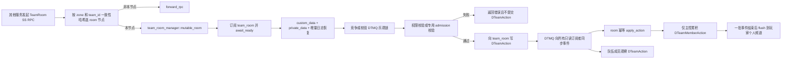

# teamsvr-room 服务分析与测试执行计划

## 当前执行状态（2026-08-23）

自动化测试已在 `${PROJECT_NAME}-teamsvr-room-unit-test` 落地；当前源码共定义 96 个 case。原先“57 个
用例全部通过”的统计已经落后于后续新增用例。本轮重新构建后 96/96 通过，CTest
`--repeat until-fail:2` 连续两次通过；每次后续变更仍须以 §7 所列构建和 CTest 结果为准。按阶段 A～D
的 P0/P1 主体推进：

- 已完成：INF/CRT/ROU 基础设施与创建路由、PERM-01～12/14 权限零写入门禁、ADM 邀请与加入全流程、
  EVT 核心事件应用、CMP 数量/时间压缩与快照内容、RCV 快照加增量恢复、LCK 基础锁转移和 LIFE
  心跳/时间轮/房间生命周期主体（完整与部分覆盖边界详见 §4 矩阵标记）。
- 夹具采用 §3.2 的“快速业务层”方案：typed SS mock 复刻 dtmq 服务端锁 CAS、hash chain journal、
  custom/private 快照保存与压缩边界语义，并内置 per-RPC 故障注入钩子（提交后丢响应/预提交失败）。
- 期间调整一处角色门槛设计并修复一处生产缺陷（见 §5 FIX-05/FIX-06）：角色门槛按阶梯大小比较
  （不高于 GUEST 视为未配置，其余自定义档位按数值生效）；`send_action` 在队伍销毁后仍接受业务写入。
- 未完成：真实 `wal_publisher` WAL 层（§4.6）、CON 并发组与 FLT 故障脚本（§4.7）、BND 边界组
  （§4.9）。夹具使用 runtime pump 和虚拟时钟，不以 sleep、网络抖动或 CPU 调度作为通过条件；
  fault script 未被消费、runtime task 失败或 event-sync 失败均必须使 case 失败。
- 本计划范围限定为离线 mock 单元测试，不包含真实进程集成测试。

用例矩阵状态标记：✅ 已实现且稳定通过；🔶 部分实现（存在子项缺口）；⬜ 未实现。

## 1. 目标与边界

本文档基于当前 `src/teamsvr/service/room`、组队协议、DTMQ Client Subscriber 以及仓库现有
`rpc-unit-test` 设施制定，目标是：

- 说明 `teamsvr-room` 当前的职责、状态归属和完整写入/恢复流程。
- 给出能够在本仓库逐步落地的自动化测试结构、用例矩阵、执行顺序和验收标准。
- 明确区分当前代码已经实现的行为、需要测试锁定的契约，以及实现尚不完整、不能直接写成绿色断言的契约。

计划文件本身不代表测试已经实现或执行。第一阶段仅新增测试代码和 CMake 目标，不修改生产行为；测试暴露出契约差异后，
再用独立变更修复生产代码。

优先级定义：

- P0：权限、单写者、快照完整性、恢复和故障转移等正确性红线。
- P1：邀请/申请、通知、心跳、离线清理、队长切换和房间生命周期。
- P2：路由异常、重复请求、边界配置、性能和长时间稳定性。

## 2. 当前服务代码分析

### 2.1 文件职责

| 路径 | 当前职责 |
| --- | --- |
| `src/teamsvr/protocol/room/protocol/pbdesc/team_room_service.proto` | Room SS RPC、`DTeamRoomPrivateData` 和成员运行时私有数据协议 |
| `src/server_frame/protocol/public/protocol/pbdesc/com.struct.team.proto` | `DTeamConfigure`、队伍/成员/邀请/申请状态、`DTeamAction`、`DTeamMemberAction` |
| `src/teamsvr/service/room/logic/action/task_action_*.cpp` | 一致性哈希路由、转发、本地 room 获取、RPC 结果封装 |
| `src/teamsvr/service/room/logic/room/team_room.cpp` | 权限、DTMQ 写入、事件应用、通知、锁、压缩、恢复和定时维护 |
| `src/teamsvr/service/room/logic/room/team_room_manager.cpp` | room 缓存、唯一时间轮定时器、待发个人频道消息批量 flush |
| `src/teamsvr/service/room/logic/dtmq/task_action_channel_event_sync.cpp` | 接收 DTMQ 推送并在一批事件结束后 flush `DTeamMemberAction` |
| `src/teamsvr/service/room/app/team_room_main.cpp` | 注册 Room/DTMQ RPC handler，驱动 Subscriber 和 room manager tick |

### 2.2 状态归属

| 状态层 | 数据 | 可见范围与恢复用途 |
| --- | --- | --- |
| DTMQ `custom_data` | `DTeamStorage`：team key、队长、权限配置、成员列表、邀请、加入请求、共享队伍数据、确认/保存序号 | 所有只读订阅者可见；压缩和新主控恢复的公共权威快照 |
| DTMQ `private_data` | `DTeamRoomPrivateData`：`team_created`、上次压缩序号/时间、`private_team_data` | 仅申请了 private data 的 room 主控候选节点可见；恢复主控私有状态 |
| DTMQ 增量日志 | `DTeamAction` | 所有队员和 room 节点订阅；压缩点之后按序重放 |
| 玩家个人频道 | `DTeamMemberAction` | 尚未入队或需要单独回执的玩家；不是队伍权威写入日志 |
| room 本地运行时 | 乐观锁、成员 LRU、删除重试队列、待发个人通知、定时器、压缩调度时间 | 不直接作为故障恢复来源；可由快照、日志和当前锁重新建立 |

当前实现中，`DTeamRoomMemberRuntimeData` 只有协议定义，没有写入或恢复路径；成员的
`last_heartbeat_timepoint` 和 `user_router_server_id` 仍包含在 `DTeamStorage.member` 中。
`DTeamRoomPrivateData.team_key` 也没有被 `dump_private_data` 写入，恢复时不读取。测试落地前需要先确认这两个字段的最终契约，
避免把暂时行为固化成长期协议。

### 2.3 请求、日志与通知主流程



关键不变量：

1. `team_room` 频道是队伍状态的唯一写入日志；外部服务和普通成员不应直接改 room 本地状态。
2. `DTeamAction` 用于队伍内共享状态；`DTeamMemberAction` 只承担邀请、申请结果、入队和被移除等个人通知。
3. 所有 room 节点都可只读应用事件，但只有持有乐观锁的节点发送个人频道副作用和权威写入。
4. 权限失败必须在 `send_action` 之前返回，DTMQ team 频道和个人频道调用计数都保持不变。
5. 快照恢复期间暂时撤销本地主控身份，避免重放历史日志时重复发送个人通知。

### 2.4 各类写操作

- 创建队伍：可由 UUID 接口生成 team id；目标节点初次 `send_update(save=true)` 写入公共/私有初始快照，创建者成为
  owner 和队长。`team_created_` 在等待加锁前先占位，避免同节点并发重复创建。
- 普通管理动作：`send_message` 先执行 `check_action_permission`。非 admission 动作直接写一个 `DTeamAction`；
  invitation/join request 动作转到专用方法，统一填充过期时间、成员信息和个人频道。
- 接受邀请或批准申请：先写 `add_member`，再写 approve 事件。第一步成功、第二步失败时，重试会跳过已存在成员并继续清理
  admission，属于必须验证的部分成功恢复场景。
- 事件应用：更新成员、队伍、邀请/申请映射和队长；重复事件需幂等。`sequence` 只保证递增，不要求连续。
- 接收路径契约：room 注册在 `on_receive_raw_message`（DTMQ 的 `common_action` 对每种 command_case 在 ready 后恰好回调一次），
  而不是只收 kEvent 的 `on_receive_event`。频道日志不止 event：服务端在 update/reset_lock/send_message 携带锁检查器成功时
  都会追加 kResetLock 日志（`mq_channel::set_lock` append_log），乐观锁每次续租就产生一条，另有 kCreate/kDestroy/kText。
  ack 与最老未压缩日志时间点必须覆盖全部日志种类，否则空队伍只有续租日志时按时间维度的压缩加速永远不触发
  （曾经只监听 event 导致该缺陷，已修复并由 EVT-11/CMP-13 锁定）。`DTeamAction` 只从 kEvent detail 解包应用；
  其余种类仅推进 ack、oldest-log 和 destroy 标记；快照回放与实时路径处理同一全量日志流，两者行为必须一致。
- 个人通知：新增邀请通知 invitee；邀请/申请批准或拒绝通知对应的非成员；移除成员通知被移除者。队伍成员本身通过
  `DTeamAction` 观察状态，不为每个成员复制个人通知。
- 心跳：只更新 room 本地成员状态和确认序号，不写 `DTeamAction`；路由 server id 为 0 表示反订阅，不刷新在线时间。
  离线截止时间取 `max(快照恢复时间, 入队时间, 最后心跳) + member_offline_expire`：快照恢复时间作为下限，保证故障切换后
  快照中陈旧心跳不会导致在线成员被立即踢出（曾经存在以入队时间为比较基准、兜底失效的缺陷，已修复并由 LIFE-13 锁定）。
  对未创建队伍发心跳会先 auto-create 频道并抢到锁，再返回 member-not-found；产生的幽灵空房间靠 empty-room 销毁自洁。

### 2.5 权限模型

`DTeamConfigure` 中的角色值不高于 `GUEST(0)` 时表示未配置、使用默认门槛。GUEST/NORMAL/ADMIN/OWNER 只是当前定义的档位参考点，方便以后在任意档位之间插入新角色；因此角色与门槛的比较一律按大小进行（`>=`/`<`），不做等值判断，自定义中间档位按数值直接生效。

| 动作 | 默认门槛/特殊规则 |
| --- | --- |
| 删除自己 | 任意成员可主动退出 |
| 删除其他成员 | `manage_member_role`，默认 ADMIN |
| 直接添加成员 | `manage_member_role`，默认 ADMIN；不能添加已存在成员，也不能授予高于操作者的角色 |
| 更新自己成员数据 | 任意成员 |
| 更新其他成员数据 | `manage_member_role`，默认 ADMIN |
| 更新队伍共享数据 | `update_team_data_role`，默认 NORMAL |
| 当前队长主动转让 | 当前队长可转让给任意现有成员 |
| 非当前队长无条件修改队长 | 固定 OWNER，不可配置 |
| 解散队伍 | 固定 OWNER，不可配置 |
| 发起邀请 | 邀请人必须等于操作者且达到 `invite_role`，默认 NORMAL |
| 同意邀请 | 仅被邀请人本人，允许游客 |
| 拒绝自己的邀请 | 被邀请人本人，允许游客 |
| 拒绝/撤回他人的邀请 | `reject_invitation_role`，默认 ADMIN |
| 发起加入请求 | 请求人必须等于操作者且当前不是成员；默认允许游客，`disable_join_request=true` 时禁止 |
| 同意/拒绝加入请求 | `approve_join_request_role`，默认 NORMAL |

专用 invitation/join request RPC 也执行等价校验，不能只测试通用 `send_message` 入口。

### 2.6 压缩、恢复与故障转移

- 当前只有创建队伍和定时维护两个 `send_update` 调用点。创建是无历史日志的初始保存；主控定时维护使用一次
  `send_update` 完成乐观锁续租，并在存在可裁剪日志时同时写快照和压缩。以后新增调用点也必须显式验证是否可同时压缩。
- 每次维护调用 `send_update` 前都会调用 `pick_compact_sequence`；`compact_log_over_percent` 和
  `compact_log_start_time` 只用于提前安排维护，不是允许压缩的硬门槛。
- 数量策略保留 `max(gc_log_count * keep_percent, keep_count)` 条；时间策略保留
  `compact_log_keep_time` 窗口内日志；最终选择兼顾两种保留策略的裁剪点。
- 压缩时 `custom_data` 应覆盖最新成员、邀请、申请、配置和共享数据，`private_data` 应覆盖主控私有数据；
  `saved_action_sequence` 表示快照状态覆盖到的最新日志，`last_compact_sequence` 表示已裁剪边界。
- 恢复时先完整解析公共/私有快照，再覆盖本地状态，然后从 `last_compact_sequence + 1` 回放缓存日志，最后才接管当前锁。
- 非主控在当前锁超时后尝试 CAS 接管；旧主控后续写入收到锁冲突后立即退位。
- 已解散队伍先写 `destroy_team`，随后主控销毁 DTMQ 频道；manager 延迟回收 room。

### 2.7 `apply_add_member` 的 move 结论

当前签名已经是 `apply_add_member(DTeamMember&&, time_point)`，主要热路径也已使用 move：

- DTMQ 事件应用从 `action.mutable_add_member()` move 到 `apply_add_member`。
- 创建队伍从临时 `public_data.member(0)` move 到 `apply_add_member`。
- `apply_add_member` 最终 move-assign 到 `member->member_data`。

快照恢复循环读取的是 Subscriber 持有的 const 公共快照，必须保留该快照供缓存和其他订阅者使用，因此这里复制到本地成员是合理的，
不应通过 `const_cast` 强行 move。功能测试应验证 move 前后字段完整、重复 add 不回退更早入队时间和较新的心跳/路由状态；
protobuf 内部分配次数只能作为可选基准测试或 profiler 指标，不作为功能测试门禁。

## 3. 测试实现架构

### 3.1 自动化目标

仓库约定：每个可执行程序/库只生成一个单元测试可执行程序（参照 `${PROJECT_NAME}-lobbysvr-unit-test`）。
team room 服务只建立一个目标，不为场景类别拆分多个 target：

| 目标 | FEATURES | 内容 |
| --- | --- | --- |
| `${PROJECT_NAME}-teamsvr-room-unit-test` | `SS RESOURCE DB HPA` | 本计划全部离线用例：action/权限/admission/通知、journal/压缩/快照/重放/锁转移/crash checkpoint、与真实 `mq_channel`/WAL 的跨层契约、心跳/时间轮/离线/空房间/destroy、team id 为 0 的 UUID/DB 路径 |

- SS：mock DTMQ Proxy RPC、转发 RPC，并用 typed action helper 驱动真实 Room action。
- RESOURCE：提供 channel type 11 的 `ExcelDtmqChannelType`，使 `client_subscriber::create` 可执行。
- DB/HPA：因 UUID/DB 路径用例和真实 `mq_channel` 跨层契约用例与业务用例同处一个 executable，统一启用；
  不需要 DB/HPA 的用例不得隐式依赖其副作用。

`rpc-unit-test` 的 fixture 在一个 executable 内串行运行，Excel/config 等对象带进程级生命周期，CTest `TIMEOUT`
是整个 executable 的总预算。单目标下用以下方式控制运行粒度和隔离：

- 用 fixture 分组名（如 `teamsvr_room_permission.*`、`teamsvr_room_wal.*`、`teamsvr_room_lifecycle.*`）配合
  `-r` 正则过滤做局部运行；CI 默认全量串行。
- `TIMEOUT` 按全部 fixture 最坏耗时之和设置，并保持四层超时关系：单 RPC < task timeout < runtime hard timeout < CTest timeout。
- 用例间隔离靠夹具（3.2 第 8～10 项）：每例唯一 team/channel id、结束 `team_room_manager::clear()`、恢复 now offset；
  连续运行两次不得有 singleton/时间轮污染。

Room 服务是 executable 而不是可链接库，测试目标应像现有 DTMQ/lobbysvr service 测试一样直接编译所需服务源：

- `logic/room/team_room.cpp`
- `logic/room/team_room_manager.cpp`
- 需要覆盖的 `logic/action/task_action_*.cpp`
- `logic/dtmq/task_action_channel_event_sync.cpp`

链接 `components::dtmq-proxy-sdk`、`sdk::team-sdk-room`、`sdk::team-common-sdk` 和 room config 协议目标；复用
`teamsvr-room` 的预编译头，并为 service 目录增加私有 include path。不要编辑生成文件。

实现注意：

- CMake 目标名使用 `${PROJECT_NAME}-teamsvr-room-unit-test` 而非硬编码 `atf4g-co-` 前缀，并像
  lobbysvr 测试一样用 `generate_for_pb_collect_output_from_flows` 收集 TeamRoomService 的生成文件、
  `generate_for_pb_add_dependencies` 建立生成依赖、`add_dependencies(... resource-config)` 保证 Excel 表就绪。
- Windows 下本构建树的 ninja 头文件依赖追踪不完整：给 `team_room.h` 等头文件新增 test accessor 后，必须删除
  `<BUILD_DIR>` 下对应目标 `.dir` 里的相关 `.obj` 再重编，不要 `ninja -t clean`。

### 3.2 测试夹具

新增建议文件：

```text
src/teamsvr/test/teamsvr_room_test_common.h
src/teamsvr/test/teamsvr_room_test_permission.cpp
src/teamsvr/test/teamsvr_room_test_admission.cpp
src/teamsvr/test/teamsvr_room_test_recovery.cpp
src/teamsvr/test/teamsvr_room_test_wal.cpp
src/teamsvr/test/teamsvr_room_test_lifecycle.cpp
src/teamsvr/test/teamsvr_room_test_action.cpp
```

`teamsvr_room_test_common.h` 只放无状态构造器、RAII 和共享夹具，避免每个文件复制 DTMQ mock。夹具至少提供：

1. 注册 `teamsvr_room_cfg` loader，使用最短但合法的过期、压缩、重试和销毁时间。
2. 向 mock resource 写入 channel type 11，设置 `max_log_count`、`gc_log_count`、心跳和 subscriber timeout。
3. 注入本地 `teamsvr-room` 与 `dtmq-proxysvr` discovery 节点并 reload discovery index。
4. mock subscribe heartbeat，使 room Subscriber 可以进入 ready。
5. `fake_team_room_channel`：维护 channel key、sequence/hash、锁、custom/private data、日志和销毁状态；捕获
   `send_message`、`update`、`reset_lock`、`destroy_channel` 请求并生成相应响应。
6. `push_snapshot`/`push_actions`：构造 `SSChannelEventSync`，按 DTMQ 的 hash chain 规则把快照和增量日志推回真实
   `client_subscriber::global_receive_channel_event`。
7. 捕获发送到玩家个人频道的消息并解包 `DTeamMemberAction`。
8. `global_now_offset_guard`：只推进 `time_utility::now()`，不影响 runtime 的硬超时；每个用例结束恢复偏移。
9. 用例结束调用 `team_room_manager::clear()`，释放 room 和定时器；每个用例使用唯一 team/channel id。
10. tick 驱动器：测试目标不链接 `team_room_main.cpp`，没有任何模块替 fixture 调 tick。夹具必须显式驱动
    `team_room_manager::init()`/`team_room_manager::tick(ctx)`（room 时间轮）与
    `rpc::dtmq::client_subscriber::global_tick(ctx)`（Subscriber 心跳/定时器），可在 `run_task` 内按脚本逐轮驱动；
    生命周期用例通过“推进 now offset + 驱动一轮 tick”精确触发定时事件，不允许靠真实 sleep 等待。

`fake_team_room_channel` 不应自行发明一套与 DTMQ 不同的时序语义。建议分两层：

- 快速业务层：用 SS typed mock 保存请求，在 handler 内更新轻量 journal，再通过 `SSChannelEventSync` 回推；适合权限和
  action 用例。
- WAL/恢复层：直接复用 DTMQ server test 已使用的 `mq_channel` 和实际
  `atfw::util::distributed_system::wal_publisher`（真实命名空间是 `atfw::util`），调用
  `allocate_log`/`emplace_back_log`、`dump_snapshot`、`load_snapshot`、`compact_stateful_sequence` 和
  `compact_sequence`。把 publisher 产生的 snapshot/log 适配成 `SSChannelEventSync` 喂给 Room Subscriber。

WAL integration 层只把 `mq_channel` 当进程内权威 journal，不在同一进程启动第二套 atapp runtime。这样既能使用真实
sequence、hash、subscriber checkpoint、GC 和压缩边界，又不违反 `rpc-unit-test` 一进程一 runtime 的约束。Room 和
DTMQ Proxy 各自使用不同的 server-instance config 类型，实现前先做一个 compile/start smoke；如果完整
`mq_channel_manager` 确实依赖 DTMQ Proxy 专属进程配置，则只在该目标内使用独立 `mq_channel`/publisher，或增加最小的
test-only config seam，不能复制一份生产 WAL vtable 来绕过。通用 WAL/DB/transfer 行为继续由现有
`component-dtmq-proxysvr-unit-test` 覆盖；Room 目标只测跨层契约，避免复制 DTMQ 自测。

若仅靠公开行为无法断言内部 LRU、重试队列或压缩选择，可以新增最小的 test accessor，并只在
`PROJECT_SERVER_FRAME_ENABLE_UNIT_TEST_HOOKS` 下提供；不要使用 `#define private public`，也不要扩大生产 API。

### 3.3 统一断言维度

每个业务用例按需要同时检查以下观察点，不能只看 RPC 返回码：

- transport result、response code 和 `client_result`。
- DTMQ team channel 的调用次数、目标 channel、锁 checker 和解包后的 `DTeamAction`。
- 注入事件后的本地成员/角色/队长/ack 状态。
- 玩家个人频道调用次数、目标 channel 和 `DTeamMemberAction` 类型/内容。
- `update` 中的 compact/stateful/saved sequence 以及 custom/private snapshot 内容。
- 未消费 mock rule、未满足 expectation、任务硬超时和 `test.stop()` 返回值。

新增一个规范化状态 oracle `canonical_team_state`：成员、邀请和申请按 user key 排序，map 按 key 比较，忽略指针、定时器、
LRU 容器物理顺序等本地实现细节，但不忽略角色、时间、router、ack/hash、权限数据和 private data。对同一 action trace 至少
比较以下四条路径：

```text
从头应用全量日志
== 最新快照 + compact 点后日志
== 中途重启后恢复并继续写
== writable 转移快照后由新主控继续写
```

protobuf 序列化字节不能作为快照等价性的唯一 oracle，因为 map/repeated 的构造顺序可能不同；必须做字段语义比较。

权限失败用例统一使用以下门禁：

```text
返回预期权限错误
AND team_room send_message 调用增量 == 0
AND personal-channel send_message 调用增量 == 0
AND update/reset_lock/destroy 调用无非预期增量
```

### 3.4 RPC Mock 故障注入规则

| 故障语义 | 注入方式 | 必查结果 |
| --- | --- | --- |
| 请求到达前失败 | handler 返回 transport/client error，不修改 journal | 无权威状态变化，调用方得到精确错误 |
| 已提交但响应丢失 | handler 先更新 journal/锁，再用 `no_response` 丢响应 | 重试不产生第二个逻辑结果，恢复能看见首次提交 |
| 延迟与乱序 | `delay_generations` 脚本化多个 rule | action、锁更新、回包和 event-sync 的所有合法顺序均满足不变量 |
| 错误响应包 | `malformed_type_url`/`malformed_body` | 不把坏包当成功，不进入错误主控状态 |
| 下行损坏 | 注入坏 Any、hash、checkpoint 或 snapshot boundary | 请求新快照或恢复失败并退位，不带部分状态继续写 |
| 节点/路由故障 | `match_node_id`、移除 discovery 节点、forward error | 不误发到其他频道/节点，不在错误节点创建 room |

所有 DTMQ team 写入和个人频道写入都必须显式注册 rule 和 `.expect(...).times(...)`。RPC Mock 对未匹配的 no-wait/stream
默认会“记录并成功”，不显式期望会产生假绿。延迟请求至少推进到 transport 的 `N+2` generation barrier 后再断言；所有断言
放在 `wait()` 之后，异步 handler 不捕获 case 栈上的引用。

## 4. 自动化用例矩阵

状态标记：✅ 已实现且稳定通过；🔶 部分实现；⬜ 未实现。部分实现与未实现项的缺口见文首“当前执行状态”。

### 4.1 基础设施与创建/路由

| ID | 状态 | 优先级 | 场景与主要断言 |
| --- | --- | --- | --- |
| INF-01 | ✅ | P0 | fixture 启动，type 11 配置生效，subscribe heartbeat 后 ready，`with_private_data=true` |
| INF-02 | ✅ | P0 | ready snapshot 的完整 team key、锁、custom/private data 和增量日志能送达 room 回调 |
| INF-03 | ✅ | P0 | 每个 case 清理 manager；相同完整 team key 复用 room，相同 team id 的不同 zone 隔离且不串 DTMQ channel |
| INF-04 | 🔶 | P1 | typed `invoke_ss_action` 覆盖业务 action；另用 raw transport smoke case 验证 dispatcher 注册、RPC envelope 和非法 type URL/body |
| CRT-01 | ✅ | P0 | 显式 team id 创建成功；初始 update 为 `save=true`，创建者为 OWNER/队长，公共和私有初始数据完整 |
| CRT-02 | 🔶 | P1 | team id 为 0 时 UUID 成功/失败；只在生成成功后创建 room |
| CRT-03 | ✅ | P0 | sender key 非法、重复创建、已销毁频道分别返回精确错误，且无额外权威写入 |
| CRT-04 | ✅ | P0 | 创建 update 已提交但响应丢失；重新订阅/重试从已提交快照恢复，不覆盖成第二支初始状态 |
| ROU-01 | 🔶 | P1 | 本地一致性哈希目标执行本地 action；远端目标仅 forward；无 ready 节点返回 DTMQ unavailable |
| ROU-02 | 🔶 | P1 | forward transport 失败和 `forward_ok=false` 均正确映射响应，不在本节点创建 room |
| ROU-03 | 🔶 | P2 | 路由 zone 由完整 team key 决定；sender 与 team 不同 zone、目标 zone 无节点时不回退误发；invitee/applicant 跨区组合仍待补齐 |

### 4.2 权限与“拒绝时零写入”

下表每行至少包含：默认配置边界值、非成员（游客）、低一档角色、等于门槛、高一档角色，以及自定义
`DTeamConfigure` 门槛。所有失败变体都应用统一零写入门禁。

| ID | 状态 | 优先级 | 动作 | 变体 |
| --- | --- | --- | --- | --- |
| PERM-01 | ✅ | P0 | `remove_member` | NORMAL 删除自己成功；游客删除自己报 not-in-team；NORMAL 删除他人失败；ADMIN 删除他人成功 |
| PERM-02 | ✅ | P0 | `add_member` | NORMAL 失败；ADMIN 成功；重复成员失败；非法 key 失败；不能授予高于操作者的角色 |
| PERM-03 | ✅ | P0 | `member_update` | 任意成员更新自己成功；NORMAL 更新他人失败；ADMIN 更新他人成功 |
| PERM-04 | ✅ | P0 | `team_update` | 默认 NORMAL 可更新；自定义 ADMIN 后 NORMAL 失败、ADMIN 成功 |
| PERM-05 | ✅ | P0 | `election_captain` | 当前队长主动转让成功；非队长 ADMIN 失败；OWNER 成功；目标非成员失败 |
| PERM-06 | ✅ | P0 | `destroy_team` | 仅 OWNER 成功；配置字段不能降低固定门槛 |
| PERM-07 | ✅ | P0 | `add_invitation` | inviter 必须等于 sender；默认任意成员可邀请；自定义 ADMIN 门槛生效；游客失败 |
| PERM-08 | ✅ | P0 | `approve_invitation` | invitee 游客本人成功；成员本人也可；任何第三方含 OWNER 都不能代为同意 |
| PERM-09 | ✅ | P0 | `reject_invitation` | invitee 游客本人成功；默认 ADMIN 可拒绝他人邀请；NORMAL 失败；自定义角色生效 |
| PERM-10 | ✅ | P0 | `add_join_request` | 非成员本人默认成功；伪造 requester 失败；现有成员 already-in-team；私人队伍禁止外部申请；未创建队伍返回 room-not-found 且零写入（专用 RPC 与 `send_message` 转换路径一致） |
| PERM-11 | ✅ | P0 | approve/reject join | 默认任意成员成功；游客失败；自定义 ADMIN 后 NORMAL 失败、ADMIN 成功 |
| PERM-12 | ✅ | P0 | action case 缺失/未知 | invalid-param，零写入 |
| PERM-13 | 🔶 | P0 | 专用 RPC 对照 | invitation/join 的六个专用 RPC 与通用 `send_message` 得到相同权限结论和日志形状 |
| PERM-14 | ✅ | P1 | 角色阶梯比较 | GUEST 及以下使用默认门槛；门槛比较一律按大小（含等于），低于 NORMAL 的自定义门槛、NORMAL/ADMIN 之间的自定义角色（如 150）与高于 OWNER 的档位（如 350）均按数值生效，验证未来插入新档位无需修改比较逻辑 |
| PERM-15 | ⬜ | P1 | 内外 team key | outer team id 与 destroy/remove/admission 内嵌 team id 不一致时拒绝或统一改写为当前 room，绝不向成员发布矛盾标识 |
| PERM-16 | ✅ | P0 | `member_set_role` | 非成员操作者 not-in-team；目标非成员 member-not-found；目标角色不高于 GUEST 报 invalid-param；NORMAL 低于默认门槛(ADMIN)失败；ADMIN 授予高于自身的 OWNER 失败；ADMIN 授予同级 ADMIN 成功；OWNER 降级他人成功 |
| PERM-17 | ✅ | P0 | `member_set_role` 自定义门槛 | 配置 set_member_role_role=NORMAL 后 NORMAL 可授予不高于自身的角色；授予高于自身的角色仍失败（自定义门槛不改变授权上限） |
| PERM-18 | ✅ | P1 | 配置默认门槛修订下发 | create 快照 custom_data 与 team_update 增量事件中的 configure 均携带修订后的完整门槛（revise_configure_default_permission），不允许出现 GUEST 占位，订阅者无需自行补默认值 |

### 4.3 邀请、加入请求与个人通知

| ID | 状态 | 优先级 | 场景与主要断言 |
| --- | --- | --- | --- |
| ADM-01 | ✅ | P0 | 新邀请补齐 team id、start/expire；写一个 `add_invitation`；回环后只向 invitee 发 `invited` |
| ADM-02 | ✅ | P1 | 完全重复邀请不追加日志；频道或更晚过期时间变化时更新且不缩短有效期；source/admission 数据变化按确定契约更新或明确忽略，不能追加与旧日志完全相同的冗余 action |
| ADM-03 | ✅ | P0 | `invited` 只包含 PUBLIC 的 team/member admission data，不泄露 MEMBER 数据 |
| ADM-04 | ✅ | P0 | invitee 接受有效邀请，依次写 `add_member`、`approve_invitation`；事件回环后成员为 NORMAL 并收到 `joined_team`；通知目标频道以 room 本地记录为准，事件负载中的频道字段不被信任 |
| ADM-05 | ✅ | P0 | 接受邀请时，client version、router id、shared member data 来自 invitee 本人请求，不能由 inviter 伪造 |
| ADM-06 | ✅ | P1 | `add_member` 成功但 approve 写入失败后重试：不重复添加成员，最终清理邀请并只产生一次有效结果通知 |
| ADM-07 | ✅ | P0 | 自己拒绝、管理员撤回分别写 `reject_invitation`；成员通过 team log 感知，invitee 收个人回执 |
| ADM-08 | ✅ | P0 | 过期邀请 approve 返回 not-found；reject 幂等成功；room 清理不发送 cancel/reject 个人通知 |
| ADM-09 | ✅ | P0 | 新加入请求规范化 team id/默认过期时间，保留申请人的频道、版本、router 和 admission data |
| ADM-10 | ✅ | P1 | 完全重复加入请求不追加日志；频道或更晚过期时间变化可刷新且不缩短有效期；version/router/source/admission 数据变化按确定契约处理，不能写无变化的冗余 action |
| ADM-11 | ✅ | P0 | 批准申请依次写 `add_member`、`approve_join_request`；成员数据来自原申请；申请人收到 `joined_team` |
| ADM-12 | ✅ | P0 | 拒绝申请写 `reject_join_request`；申请人收到拒绝通知；队伍成员不额外收到个人通知 |
| ADM-13 | ✅ | P0 | 过期申请 approve 返回 not-found；reject 幂等成功；维护清理不发个人通知 |
| ADM-14 | ✅ | P0 | 备用 room 应用同一批历史 admission 日志不发送 `DTeamMemberAction`，接管后只发送新事件的副作用 |
| ADM-15 | ⬜ | P1 | 多个 invitee/requester 并存时，按 user key 独立更新、批准、拒绝和清理，不串频道或数据 |
| ADM-16 | ✅ | P1 | 目标已是成员时再次 approve（双击/断线重连重试/重放）：不再写第二个 `add_member`，仍清理 admission 并只补一次 `joined_team`；`approve_invitation` 与 `approve_join_request` 两条路径行为一致 |

### 4.4 事件应用、成员和队长

| ID | 状态 | 优先级 | 场景与主要断言 |
| --- | --- | --- | --- |
| EVT-01 | ✅ | P0 | sequence 有缺口但递增时正常应用；ack sequence/hash 只前进不回退 |
| EVT-02 | ✅ | P0 | `add_member` 缺少入队/心跳时间时使用事件时间；首成员成为 OWNER/队长 |
| EVT-03 | ✅ | P0 | 重复 `add_member` 不改变 user key、不推迟更早入队时间、不回退更新的心跳和 router 状态 |
| EVT-04 | ⬜ | P1 | `member_update` 合并字段；管理员更新他人不错误刷新心跳 LRU；自己更新可更新 router/channel；管理员携带他人 router 值按 GAP-05 处理 |
| EVT-05 | ⬜ | P1 | `team_update` 合并 configure/shared data，未携带字段保持原值 |
| EVT-06 | ✅ | P0 | 队长移除后，在剩余成员中按 joined time、user key 确定性选举，并写一个 election action |
| EVT-07 | ✅ | P0 | remove 事件幂等；被移除者只收到一次有效移除通知；重放不重复副作用 |
| EVT-08 | ✅ | P0 | 损坏的 `DTeamAction Any` 使 room 退位，不应用部分状态，不继续以旧锁写入 |
| EVT-09 | ✅ | P1 | destroy 事件标记 room 已销毁，后续业务写入返回 destroyed |
| EVT-10 | 🔶 | P0 | event-sync 批次含重复、乱序、hash 不匹配、旧 compact 点日志和中途坏 Any；区分 Subscriber 拒绝与 Room 应用失败，已应用前缀和 flush 行为符合明确契约 |
| EVT-11 | ✅ | P0 | 非 `DTeamAction` event、text/raw/create/destroy 等 DTMQ detail 不被误解为队伍 action；kResetLock（续租产生）、kCreate、kText 等非 event 日志同样推进 ack sequence/hash 和最老未压缩日志时间点，destroy detail 置销毁标记 |

### 4.5 日志压缩、快照恢复和锁转移

| ID | 状态 | 优先级 | 场景与主要断言 |
| --- | --- | --- | --- |
| CMP-00 | ⬜ | P0 | 枚举所有 `send_update` 调用点：初始创建无历史日志；每个后续 update 流程都调用压缩选择或证明无可压缩日志 |
| CMP-01 | ✅ | P0 | 无可压缩日志时维护仍发送一次续租 update，但不设置 compact/custom/private snapshot |
| CMP-02 | 🔶 | P0 | 每次维护都重新尝试选择压缩点；未达到 over-percent/start-time 也不被这两个加速条件硬性禁止 |
| CMP-03 | ✅ | P0 | 数量策略：按真实缓存条数而非 sequence 差值；sequence 有缺口时保留条数仍准确 |
| CMP-04 | 🔶 | P0 | 时间策略：只裁剪 keep-time 窗口之外日志；缺省 keep-time 为 start-time 一半且不大于 start-time |
| CMP-05 | 🔶 | P0 | 数量和时间裁剪点并存时选择更保守边界；keep count/percent 边界值准确 |
| CMP-06 | ✅ | P0 | compact update 的 custom data 包含配置、队长、全部成员、邀请、申请、共享数据和最新 ack/saved sequence |
| CMP-07 | ✅ | P0 | compact update 的 private data 包含 team-created、当前 compact sequence/time 和全部私有队伍数据 |
| CMP-08 | ✅ | P0 | `saved_action_sequence` 覆盖快照所含最新状态，`last_compact_sequence` 仅表示裁剪边界，两者不混用 |
| CMP-09 | 🔶 | P0 | compact 已在 DTMQ 提交但 update 响应丢失；旧主控不得以旧边界覆盖，新主控从 DTMQ snapshot/剩余日志恢复等价状态 |
| CMP-10 | 🔶 | P0 | admission 先在本地过期清理，随后 update 失败/锁冲突；验证重试、退位和新主控恢复不会永久丢记录或错误批准 |
| CMP-11 | 🔶 | P1 | snapshot 覆盖到 `saved_action_sequence`，但只裁到更早 `last_compact_sequence`；重叠日志重放必须幂等且不回退状态 |
| CMP-12 | 🔶 | P1 | 加速触发方向：未压缩日志真实条数同时超过 `gc_log_count * compact_log_over_percent` 与保留条数时立即触发维护；最早未压缩日志超过 `compact_log_start_time` 时把维护提前到该时间点；压缩推进后最早未压缩日志时间点随缓存刷新并正确参与下一轮调度 |
| CMP-13 | ✅ | P0 | 只含 kResetLock 续租日志的空闲频道：最老未压缩日志时间点取最早一条续租日志（而非等待下一条 event），时间维度加速按该时间点触发维护并完成压缩；oldest-log 时间点 0→有效 迁移时立即重算定时器，不等下一次锁续租 |
| RCV-01 | 🔶 | P0 | 只从完整快照恢复，成员、角色、队长、邀请、申请、公共/私有数据与原 room 等价；成员按 `max(入队, 心跳)` 升序进入 LRU（经 test accessor 断言），保证 failover 后最久未活跃成员最先被踢 |
| RCV-02 | ✅ | P0 | 从快照加 compact 点后增量日志恢复，结果与从头应用全量日志等价 |
| RCV-03 | ✅ | P0 | 恢复期间不发送历史个人通知；恢复结束后按当前锁决定主/备身份 |
| RCV-04 | ✅ | P0 | custom 或 private Any 类型损坏时恢复失败、room 不进入可写主控状态 |
| RCV-05 | ✅ | P0 | 快照含非法/重复成员 key 时按当前容错规则处理，且不会破坏合法成员和 captain 一致性 |
| RCV-06 | 🔶 | P0 | private data 缺失、落后或与 custom data 不同代；已创建队伍不得静默丢失 private team data，兼容策略必须可判定 |
| RCV-07 | 🔶 | P0 | `last_compact_sequence`、`saved_action_sequence`、snapshot last sequence/hash 和首条剩余日志边界矛盾时拒绝成为 writer并重新拉 snapshot |
| RCV-08 | 🔶 | P0 | 心跳/router/成员 ack 更新后无新 team log 即发生切主；新主控不得恢复成会误踢在线成员的旧运行时状态 |
| RCV-09 | 🔶 | P0 | 崩溃点分别位于 add-member 提交前后、approve 提交前后；重试后最终只有一个成员和一个已完成 admission 结果 |
| RCV-10 | 🔶 | P0 | destroy-team 提交、destroy-channel 提交及各自响应丢失后重启；旧 team id 不得被重新创建或恢复成可写未销毁队伍 |
| RCV-11 | ⬜ | P1 | 固定 seed 生成混合 action trace，在每个合法 compact/重启点恢复，规范化终态始终与全量日志 oracle 相同 |
| LCK-01 | 🔶 | P0 | 空锁、已过期他人锁可 CAS 接管；未过期他人锁不写入并按超时时间重新调度 |
| LCK-02 | ✅ | P0 | reset/send/update 返回真实锁冲突时立即 step down；后续个人通知和权威写入停止 |
| LCK-03 | ✅ | P0 | RPC 响应丢失但真实 lock holder 已是本节点时按幂等成功处理 |
| LCK-04 | ✅ | P0 | 接管缺失队长但仍有成员的快照后，只由新主控产生确定性 election action |
| LCK-05 | ✅ | P0 | event 已应用并排队个人通知、flush 前锁转给他人；旧主控不得继续发送该副作用 |
| LCK-06 | 🔶 | P0 | 两个候选同时以同一旧锁 CAS，只有一个成功；失败者即使随后收到迟到 event/response 也不能恢复 writer 身份 |
| LCK-07 | 🔶 | P0 | 续租 update 与普通 send_message 并发、回包乱序；较旧响应不能回退 current lock/compact 状态 |
| LCK-08 | ⬜ | P1 | writable DTMQ 节点迁移/readonly snapshot transfer 期间 Room 锁租约切换，任一 lock epoch 至多一个副作用生产者 |
| LCK-09 | ⬜ | P1 | 锁租约配置契约：租约不短于频道 `subscriber_timeout`（配置缺失时按 2*心跳+重试推导），续租间隔为租约一半且不低于 1s；违反时续租必然晚于锁过期，属于必须红灯的配置错误 |

### 4.6 真实 WAL、checkpoint 与快照契约

以下用例在 room 测试目标内复用 `mq_channel` 的实际 `wal_publisher`。它们验证 Room 与 DTMQ 的接缝，不替代已有
DTMQ component 测试。

| ID | 状态 | 优先级 | 场景与主要断言 |
| --- | --- | --- | --- |
| WAL-01 | ⬜ | P0 | publisher 分配并提交混合 `DTeamAction`，真实 sequence/hash chain 经 `SSChannelEventSync` 后 Room 终态与 journal 一致 |
| WAL-02 | ⬜ | P0 | subscriber checkpoint 正常时只下发后续日志；checkpoint hash 不匹配时强制 snapshot，不在错误分支继续增量 |
| WAL-03 | ⬜ | P0 | 慢 subscriber 落后于 `last_removed_key` 时收到 snapshot；跟得上的成员订阅者仍只收增量，二者最终状态等价 |
| WAL-04 | ⬜ | P0 | `compact_sequence` 边界的保留/删除语义与 Room `last_compact_sequence + 1` 重放起点一致，包含非连续 sequence |
| WAL-05 | ⬜ | P0 | `dump_snapshot` -> 新 `mq_channel::load_snapshot` -> Room restore 往返，custom/private/lock/messages/compact 边界不丢失 |
| WAL-06 | ⬜ | P0 | writable transfer snapshot 含待广播日志和 custom/private data；转移后旧 publisher 不再接受有效 Room 写入 |
| WAL-07 | ⬜ | P1 | 多 subscriber 具有不同 checkpoint/心跳/超时，publisher tick、GC、snapshot fallback 不让任何成员越过未保存状态 |
| WAL-08 | ⬜ | P0 | destroy/create 新 epoch 与旧日志、旧 checkpoint 交错；Room 只接受当前频道代际，旧 team id 防重建语义保持 |
| WAL-09 | ⬜ | P1 | memory-only 与 DB-backed channel 各完成一次保存、进程内重载和 compact 后恢复，区分 Room 问题与 DTMQ 持久化问题 |

### 4.7 并发、故障窗口与崩溃点

| ID | 状态 | 优先级 | 场景与主要断言 |
| --- | --- | --- | --- |
| CON-01 | ⬜ | P0 | 两个 create task 在 acquire-lock 延迟期间并发：`team_created_` 先占位，只有一个初始 update 成功，另一个返回 no-permission 且零写入；首个 create 因抢锁失败回滚占位后，重试可再次成功 |
| CON-02 | ⬜ | P0 | 同一 invitee/requester 的新增、刷新、approve、reject、expiry 两两竞态；终态只能是一个合法状态，不能残留幽灵 admission |
| CON-03 | ⬜ | P0 | remove-member 与 heartbeat/member-update 并发；已提交删除不可被本地 touch 复活，未提交删除不能提前消失；remove 在途时同一成员 re-add（新 add_member 事件）按日志序收敛，且该成员的删除重试状态被清除 |
| CON-04 | ⬜ | P0 | 队长主动转让与队长退出/离线删除并发；最终恰有一个有效 captain 且角色变更可由日志重放复现 |
| CON-05 | ⬜ | P0 | compact update 悬挂时继续收到新 action；snapshot saved/compact 边界和后续回放不遗漏新日志 |
| CON-06 | ⬜ | P1 | 多 room 同时触发 timer、event-sync 和 pending flush；请求、个人频道及 timer watcher 不串 room |

外部调用点的故障覆盖不能只集中在 `send_message`：

| ID | 状态 | 优先级 | 调用点与故障脚本 |
| --- | --- | --- | --- |
| FLT-01 | ⬜ | P1 | subscribe heartbeat：快速失败、延迟、无节点、恢复后重订阅、旧节点迟到响应 |
| FLT-02 | ⬜ | P0 | reset-lock：CAS 冲突、提交后丢响应、malformed response、真实 holder 是自己/他人两支 |
| FLT-03 | ⬜ | P0 | team-channel send：预提交失败、提交后丢响应、no-wait drop、事件先于/后于调用回包 |
| FLT-04 | ⬜ | P0 | update/compact：预提交失败、提交后丢响应、锁冲突、迟到旧响应、坏 checker/custom/private response |
| FLT-05 | ⬜ | P0 | personal-channel send：预提交失败、已提交丢响应、重复 retry 和失锁后迟到 flush |
| FLT-06 | ⬜ | P0 | destroy-channel：预提交失败、已销毁但丢响应、锁冲突、重复 destroy 和旧 create/destroy epoch |
| FLT-07 | ⬜ | P1 | forward：目标节点消失、transport error、`forward_ok=false`、迟到成功；本节点不得同时执行 |
| FLT-08 | ⬜ | P0 | event-sync stream：整批失败、前缀成功后坏消息、重复批、来源节点切换；明确 ack 和 pending flush 结果 |

先逐调用点执行单故障，再对 P0 只做有意义的 pairwise 组合：锁转移 + 响应丢失、compact + crash、event 延迟 + 新主控接管、
个人通知丢响应 + 重试。不要做不可复现的全笛卡尔随机故障；每个脚本记录 rule 次序和 generation。

每个主要写流程至少在以下 crash checkpoint 运行一次“终止旧 room -> 新 room 从 journal 恢复 -> 重试原业务”的组合测试：

| 崩溃点 | 恢复验收 |
| --- | --- |
| DTMQ handler 修改 journal 前 | 此次操作不存在，安全重试只提交一次 |
| journal 已提交、RPC 响应未送达 | 操作可从日志/快照观察，重试幂等 |
| `add_member` 已提交、approve/reject 尚未提交 | 成员不重复，admission 最终可被清理 |
| Room 已 apply event、个人通知尚未 flush | 按最终确定的通知可靠性契约补发或去重，不能新旧主控各发一次 |
| admission 已本地过期清理、compact update 尚未提交 | 新主控从旧权威状态恢复后仍按时间判定失效，不把本地清理误当已持久化 |
| compact snapshot 已提交、旧主控尚未更新本地边界 | 新主控以 DTMQ 边界为准，旧主控的迟到操作被锁隔离 |
| snapshot 已装载、增量重放中途 | 不以半恢复状态拿锁；重新 snapshot/replay 后终态等价 |
| replay 完成、拿锁前后 | 历史个人通知为零；只有拿到当前 epoch 锁后才产生新副作用 |
| destroy-team / destroy-channel 任一步提交后 | 恢复最终单调走向 destroyed，绝不回到可写 created |

### 4.8 心跳、过期与房间生命周期

| ID | 状态 | 优先级 | 场景与主要断言 |
| --- | --- | --- | --- |
| LIFE-01 | ✅ | P1 | 成员心跳更新 router、时间和更大的 ack；较小 sequence/hash 不覆盖已有确认值 |
| LIFE-02 | ✅ | P1 | router id 为 0 不刷新在线时间；不存在成员 heartbeat 返回 member-not-found |
| LIFE-03 | ✅ | P0 | 离线到期发送 remove action，加入重试队列；事件回环后清除成员和重试状态 |
| LIFE-04 | 🔶 | P1 | remove action 在途时不重复提交；重试间隔/次数准确；成功回环后不再重试 |
| LIFE-05 | ✅ | P0 | 邀请和申请到期由维护直接从 room 状态删除，不发送任何个人通知；随后 approve 失效 |
| LIFE-06 | ✅ | P1 | 成员全部离开后等待 `empty_room_destroy_delay`，写 destroy-team，再销毁 channel，最后回收 manager room |
| LIFE-07 | ✅ | P1 | 空房间延迟期间新成员加入会取消销毁计时；非空队伍不得触发 empty-room destroy |
| LIFE-08 | ✅ | P1 | room 始终只有一个下一事件定时器；更早事件可提前定时器，较晚事件不能把到期事件延后 |
| LIFE-09 | 🔶 | P2 | 多 room 同一 manager tick 时只处理到期 room；pending flush 只扫描已登记 room |
| LIFE-10 | 🔶 | P0 | 个人频道 no-wait send 在远端处理前丢弃、接收后处理失败，以及延迟投递分别验证至多一次契约；不能因 mock 默认成功而假绿 |
| LIFE-11 | 🔶 | P0 | 失锁/step-down/on_destroyed 后清理或冻结维护 task、删除重试和 pending notification，迟到 timer 不再写 |
| LIFE-12 | 🔶 | P1 | subscribe heartbeat 超时、暂时无 DTMQ 节点、snapshot error 后恢复服务；room 不泄漏且重新 ready 后只恢复一次 |
| LIFE-13 | ✅ | P0 | 快照恢复后的离线截止下限：快照心跳早于恢复点的成员，不得早于 `restore + member_offline_expire` 被踢（回归锁定 restore 兜底，曾经按入队时间比较导致提前踢出）；心跳晚于恢复点的成员仍按心跳 + expire 计算 |
| LIFE-14 | ✅ | P1 | 对未创建队伍发心跳/普通写：订阅 auto-create 频道并抢锁后返回 member-not-found/not-in-team；产生的幽灵空房间在 `empty_room_destroy_delay` 后写 destroy-team 并回收，不残留常驻 room |

### 4.9 边界、模型测试与稳定性

| ID | 状态 | 优先级 | 场景与主要断言 |
| --- | --- | --- | --- |
| BND-01 | ⬜ | P1 | 所有 duration/percent/count 使用配置最小值、默认值和极端大值；不能出现零间隔忙循环、负时间或整数溢出 |
| BND-02 | ⬜ | P1 | 时间恰好等于 invitation/join/offline/lock/empty-room deadline，以及时钟大步前进；边界统一按当前 `<= now` 契约处理 |
| BND-03 | 🔶 | P2 | zone/team id 为 0、部分快照 key 和跨区同 team id 已覆盖；最大值、大量哈希碰撞及 user id 边界仍待补齐 |
| BND-04 | ⬜ | P1 | 大量成员、邀请、申请和接近 DTMQ 消息上限的 Any/map 数据执行 update/compact；超限必须明确失败且不留下部分快照 |
| BND-05 | ⬜ | P2 | 千级 room 的 timer + pending flush + compact 长稳，观察 task 数、内存、WAL 体积、恢复时延和无进展重试 |
| BND-06 | ⬜ | P2 | 固定 seed 的 action/model test 做数百轮混合操作并在失败时缩减 trace；CI 只跑短种子集，夜间跑长种子集 |
| BND-07 | ⬜ | P2 | `apply_add_member` 大 protobuf 的 copy/move micro benchmark 仅作趋势报告；功能门禁仍以字段完整和幂等为准 |

## 5. 当前契约差距与预期红灯

以下项目不能在第一批测试中伪装成已通过。先用精确的 pending/expected-fail 标记记录，再由对应实现变更转绿。

| ID | 需求 | 当前证据 | 测试处理 |
| --- | --- | --- | --- |
| GAP-01 | 成员运行时私有数据放在合适的 private data 中 | `DTeamRoomMemberRuntimeData` 未被使用；心跳和 router 位于 public member snapshot | 先确认隐私/恢复契约；若要求私有化，增加快照布局迁移测试，不锁定当前泄露布局 |
| GAP-02 | 被邀请者/申请者在对端自行超时失效 | `lobbysvr` 的 `dispatch_team_member_event` 仍是 TODO | Room 侧先验证“过期清理不通知”；新增跨 lobbysvr 消费者契约用例，待实现后转绿 |
| GAP-03 | 删除重试耗尽后的多节点一致性 | 当前达到上限后仅本地 `remove_member`，没有成功的 team-room 日志 | 先确定是继续重试、降级写还是保留成员；不得把本地分叉写成成功标准 |
| GAP-04 | `DTeamRoomPrivateData.team_key` 的语义 | 字段存在，但创建/压缩不写、恢复不读 | 决定删除/废弃该字段，或要求写入并校验与 channel id 一致 |
| GAP-05 | 管理员更新他人时不得伪造其 router 状态 | `apply_member_update` 的注释要求不信任该值，但当前非零值仍会写入成员数据 | 明确由 action 层清零还是 apply 层忽略，并为管理员/本人两个路径分别加断言 |
| GAP-06 | 个人频道通知的可靠性和锁 fencing | flush 先 swap 清空队列，发送失败只记日志不重试；排队后失锁也不会在发送前重新校验 | 明确至少一次/至多一次契约、通知 ID/去重方式和重试归属；修复前 LCK-05、LIFE-10 为红灯 |
| GAP-07 | 心跳/router/成员 ack 的容灾持久性 | heartbeat 只修改本地 member；维护仅在 `compact_sequence > 0` 时写 custom/private，长期无新日志时不会保存新心跳 | 要么有独立 runtime snapshot/update，要么把运行时字段放 private data 并周期持久化；RCV-08 防止切主后误踢在线成员 |
| GAP-08 | admission 过期清理与 update 原子性 | maintenance 在 `send_update` 前删除本地邀请/申请；普通 update 失败时本地已变、DTMQ snapshot 未变 | 明确失败回滚/重拉/立即重试策略；CMP-10 验证旧主控和新主控不会给出相反决定 |
| GAP-09 | 重复 admission 的可变字段策略 | 已有记录变化时实现复制旧记录，仅更新频道和更晚过期时间；source/version/router/admission data 变化可能触发一个内容未变化的日志 | 明确这些字段是 immutable、可刷新还是新请求；按决定消除冗余日志并补 ADM-02/10 |
| GAP-10 | snapshot 代际和边界校验 | restore 接受缺失 private Any；旧版频道 ID/快照没有显式代际标记，不能与合法的 `zone_id=0` 全局 team 混用 | 如需迁移旧快照，必须提供可验证的版本/迁移入口；不一致或私有数据不可证明完整时只能做 readonly 并请求新 snapshot |

以下问题已在 2026-08-22 的代码评审中修复，不属于 GAP；对应用例把它们锁定为绿色契约，防止回归：

| ID | 已修复问题 | 锁定用例 |
| --- | --- | --- |
| FIX-01 | `create_team` 曾在 `acquire_lock` 协程让出后才设置 `team_created_`，同节点两个并发 create 可重复覆写初始快照；现在让出前先占位、失败回滚 | CON-01 |
| FIX-02 | `get_member_offline_deadline` 曾把最后心跳与入队时间（而非当前最大 baseline）比较，快照恢复后兜底失效、成员可能被提前踢出 | LIFE-13 |
| FIX-03 | `add_join_request` 曾缺少队伍存在性校验，可对从未创建的 team id 写入无人能审批的加入请求；现在返回 room-not-found 且零写入 | PERM-10 |
| FIX-04 | 接收回调曾注册在 `on_receive_event`（仅 kEvent 触发），续租产生的 kResetLock 等非 event 日志不推进 ack 和最老未压缩日志时间点，时间维度压缩加速失效；现改为 `on_receive_raw_message`，覆盖全部 command_case 且每条日志恰好回调一次 | EVT-11、CMP-13 |
| FIX-05 | 五个角色门槛 getter（`get_manage_member_role` 等）原以 `== GUEST` 判定未配置，且一度按 [NORMAL, OWNER] 区间钳制越界值；按“角色是阶梯范围”的设计修订为 `resolve_permission_role`：不高于 GUEST（含非法负值）回退默认门槛，其余值（含未来插入的任意档位）按数值直接生效，门槛比较全部使用大小关系 | PERM-14 |
| FIX-06 | `send_action` 缺少 `destroyed_` 检查，`destroy_team`/destroy 事件回环后仍可向即将销毁的频道追加业务日志；现返回 `EN_ERR_TEAM_DESTROYED` | EVT-09 |
| FIX-07 | 房间、频道、路由和快照身份曾只使用 `team_id` 或静默覆盖不一致 key；现统一使用完整 `DTeamKey`，把 `zone_id=0` 视为合法的全局 team 并与分区 team 严格隔离，同时规范化 action 内嵌 key | INF-03、SDK-TEAM-01～07、RCV-04/BND-03 |

## 6. 分阶段执行

### 阶段 A：测试基础设施

> 状态：✅ 基本完成（2026-08-23）。第 3 步的 `wal_publisher` journal adapter 未做，以 §3.2 快速业务层达成同等契约；后续补 WAL 层时再按该步收窄。

1. 在 `src/teamsvr/test/CMakeLists.txt` 建立单个 `${PROJECT_NAME}-teamsvr-room-unit-test` 离线 service test target（每程序/库仅一个测试可执行程序）。
2. 完成 resource、discovery、DTMQ RPC mock、event-sync、时间偏移、规范化 oracle 和清理夹具。
3. 先做 Room + 独立 `mq_channel` 的 compile/start smoke，再复用 `wal_publisher` 建立 journal adapter 并完成 WAL-01/02；
   若遇到双 server-instance config 限制，按 3.2 节收窄 test seam，不扩散到生产 API。
4. 先实现 INF-01～04、CRT-01、一个权限拒绝零写入和一个“提交后丢响应”smoke case。
5. 要求用例可单独过滤执行，连续运行两次无 singleton/时间轮污染；所有 no-wait RPC 都有显式 expectation。

### 阶段 B：P0 业务与权限

> 状态：✅ 主体完成（2026-08-23）。PERM-01～12、14 与邀请/申请、事件幂等、队长切换全部落地；PERM-13 仅混合路径覆盖，PERM-15 未做。

1. 完成 PERM-01～13。
2. 完成邀请/申请的成功、拒绝、部分成功重试、公共数据过滤和主备副作用隔离。
3. 完成核心事件幂等、成员 move 语义和队长确定性切换。
4. P0 失败即停止进入恢复阶段，先修复权限绕过或错误写入。

### 阶段 C：压缩、恢复与故障转移

> 状态：🔶 部分完成（2026-08-23）。数量/时间压缩、真实 compact 快照加增量恢复、部分 approve 崩溃点、LCK-01～05 已落地；真实 WAL 层、完整 crash checkpoint 三类脚本、双 room 同锁竞争与乱序回包仍未完成。

1. 用实际 WAL 构造含成员、邀请、申请、共享/私有数据以及非连续 sequence 的日志。
2. 执行数量/时间两类压缩并解包 update 请求，逐字段比较快照和 publisher 的实际裁剪边界。
3. 丢弃原 room，从 compact 快照和剩余日志建立新 room，与全量 journal oracle 比对最终状态。
4. 对第 4.7 节每个 crash checkpoint 执行 pre-commit failure、commit-response-loss 和 delayed response 三类脚本。
5. 模拟旧锁、锁超时、双候选 CAS、writable transfer 和迟到回包，确认每个 lock epoch 只有一个 writer 产生副作用。

### 阶段 D：定时与生命周期

> 状态：🔶 部分完成（2026-08-23）。心跳/重试/admission 过期、空房间销毁与合法加入取消、单定时器、多 room tick、step-down、快速订阅失败恢复、恢复兜底和幽灵房间自洁已落地；LIFE-09～12 仍只有部分路径，GAP-03 未纳入绿色门禁。

1. 用全局 now offset 驱动心跳过期、重试、admission 过期、空房间销毁和 channel 回收。
2. 覆盖 manager 多 room 时间轮和 pending flush 注册表。
3. 对 GAP-03 仅记录当前结果，契约未决定前不纳入绿色门禁。

## 7. 构建与运行命令

构建目录按当前 `.vscode/settings.json` 解析为 `build_jobs_cmake_tools`，并复用其 Ninja、Debug 和 12 并发配置。
测试实现完成后的建议命令：

```powershell
cmake --build build_jobs_cmake_tools --target atf4g-co-teamsvr-room-unit-test --parallel 12
cmake --build build_jobs_cmake_tools --target atf4g-co-component-dtmq-proxysvr-unit-test --parallel 12
ctest --test-dir build_jobs_cmake_tools -R teamsvr-room --output-on-failure
ctest --test-dir build_jobs_cmake_tools -R teamsvr-room --repeat until-fail:2 --output-on-failure
ctest --test-dir build_jobs_cmake_tools -R component-dtmq-proxysvr --output-on-failure
```

列出或按 fixture 分组/单 case 过滤：

```powershell
./build_jobs_cmake_tools/publish/bin/atf4g-co-teamsvr-room-unit-test.exe -l
./build_jobs_cmake_tools/publish/bin/atf4g-co-teamsvr-room-unit-test.exe -r "teamsvr_room_permission.remove_member"
./build_jobs_cmake_tools/publish/bin/atf4g-co-teamsvr-room-unit-test.exe -r "teamsvr_room_wal.*"
```

Windows 下经 CTest 运行的目标已由 `ENVIRONMENT_MODIFICATION` 自动注入 DLL PATH；只有直接运行可执行文件时才需要在当前会话前置：

```powershell
$env:PATH = "${PWD}/build_jobs_cmake_tools/publish/bin;${PWD}/third_party/install/windows-amd64-msvc-19/bin;" + $env:PATH
```

每次执行报告必须包含：构建目标与配置、实际 case 数、通过/失败/跳过数、失败 case 的 DTMQ 调用记录、未运行项及原因。
依赖缺失导致的 skip 不计为覆盖通过。

## 8. 完成标准

- 🔶 离线 P0 主体已实现并两次稳定通过；WAL/CON/FLT 的 P0 用例未实现。
- ✅ 每个权限失败用例均证明没有提交 `DTeamAction`，而不只是检查错误码。
- 🔶 compact 快照逐字段覆盖成员、邀请、申请和其他公共/私有状态；快照加增量恢复与全量日志结果等价（CMP-06～08、RCV-02 已锁定；四路径 model oracle 未做）。
- 🔶 主备回放不重复发送 `DTeamMemberAction`，锁冲突后旧主控不能继续写或发个人通知（ADM-14、LCK-02 已锁定；多候选与 writable transfer 场景未做）。
- 🔶 每个 P0 写流程至少覆盖 pre-commit failure、commit-response-loss 和一个延迟/乱序恢复脚本（create/approve/reset-lock 的丢响应已做；pre-commit failure 与延迟乱序未系统化）。
- ⬜ 真实 `wal_publisher` 的 checkpoint/hash/compaction/transfer 接缝用例通过，慢订阅者越过 GC 边界时能回落到 snapshot。
- ⬜ 固定 seed 的 model trace 能在任意已选 compact/重启点得到同一规范化终态，失败时报告 seed 和最短 action trace。
- 🔶 过期 admission 的 room 侧清理不通知（LIFE-05 已锁定）；对端自行超时用例在 GAP-02 实现后转绿。
- 🔶 FIX 回归（LIFE-13、PERM-10、EVT-11、CMP-13 已锁定；FIX-01 的 CON-01 未实现）。
- ⬜ GAP-01～11 均有明确协议决定和相应测试，不以注释或人工判断代替；红灯未解决前不能宣称容灾覆盖完成。
- ✅ 本轮 96 个 case 无硬超时、无未消费 fault script/mock expectation，`test.stop()` 返回 0；CTest 连续两次通过。
