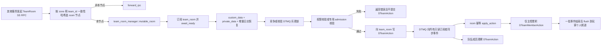

# teamsvr-room 服务分析与测试执行计划

## 当前执行状态（2026-08-29，决策落地轮）

admission 有效期澄清(2026-08-29 第六轮)：dump_public_data 的过期过滤去掉 expired_timepoint 判空
(邀请/加入请求总是必须有有效期，无有效期按已过期处理)；维护清理本就先于 dump 以无判空规则移除该类记录，
restore 保留判空兼容旧快照；`expired_admission_snapshot_filtering` 补锁定无有效期邀请经维护清理后不进入快照。

GAP-12 上限澄清(2026-08-29 第五轮)：kElectionCaptain 的 role_limit 取 max(原队长角色, 操作者角色)
(此前为存在原队长时仅取原队长)，注入场景(ADMIN 队长 + OWNER 非队长操作者转让 role=OWNER)已锁定。
注入用例经验：客户端 update_custom_data/private_data 按 sequence 单调推进，fresh 频道注入前须
ensure_created() 使序号>0；进程级订阅者缓存会丢弃同序号强制快照，原地改写状态须换新 team id。

GAP-09 语义澄清落地(2026-08-29 第四轮，含补充)：删除标记(空 value/type_url)仅用于
kTeamUpdate/kMemberUpdate 的共享数据(apply/去重谓词同步)，admission 刷新改为全量覆盖并删除两个 merge
助手；admission 的 repeated 数据允许无序，add_invitation/add_join_request 的判重改为顺序无关语义比较
(invitation/join_request_semantically_equal，按 key 归一化后整体比较)；测试 keyed-data helper 改为类型化
条目(与生产 PackFrom 对齐)，新增 `update_shared_data_delete_marker` 用例与乱序刷新不追加日志断言，
当前 125 case 全绿。

WAL-08(P0)与 WAL-07(P1)已落地(2026-08-29 第三轮)：destroy/create 新代际与防重建、多订阅者
checkpoint/心跳/超时与 GC 均由真实层用例锁定；当前 124 case 全绿(until-fail:2)。WAL 组仅剩
WAL-09(DB-backed channel，P1)。生产契约观察：destroy_team 事件应用后不重排房间定时器，
kDestroyChannel 在下一次调度点才被选中(用例按 LIFE-03 分轮推进驱动)；重建代际时 remove_before
会推进 last_removed，旧 checkpoint 落后即触发快照兜底；进程级订阅者跨代际保留旧视图，强制
checkpoint 0 重订阅可让其落到当前代际。

协议/产品决策(2026-08-29，共 12 项)已全部落地：GAP-01/03/04/06/07/08/09/10/11/12 按决策实现；
其中 GAP-03/06/07/08/09/11/12 各有锁定用例，GAP-01/04/10 按决策直接落地、无需新增用例
（见 §5 GAP 表各行与 §7 证据）；writable transfer 的事件可见延迟优化记录于 `src/component/dtmq/TODO.md`；
LCK-06/07 的"迟到不恢复 writer"确认为设计行为。本轮含生产代码变更、协议清理(删除 `DTeamRoomMemberRuntimeData` 与
`DTeamRoomPrivateData.team_key` 字段)与 6 个新锁定用例(DATA-04、GAP-12 election role、GAP-09 admission
刷新、GAP-08 过期快照过滤、GAP-07 心跳标脏保存、GAP-03 重试耗尽留日志)。注意：本工作树同时有另一 AI agent
并发推进(EVT-11/LCK-06/07/ADM 刷新语义等用例与 `debug_acknowledge_action_sequence` 钩子)，该轮全量 122 case
（含双方用例）通过；合入 WAL-07/08 两轮后当前为 124 case 全绿。

前一轮（同日，WAL-05/06 轮）：测试程序 `-l` 确认注册 116 个 case；现有 Ninja/Debug/MSVC x64 构建树
（build.ninja 为 8/24 旧态，经 CMake 自动重新生成）全量运行通过，`--repeat until-fail:2` 连续两次通过，
另做 4 轮重复全部绿色。CTest 注册的是 1 个串行 executable，116 是该 executable 内部的 case 数；二者不能混为 CTest 的 test 数。
申请受理回执的 `lobbysvr` 消费者也已由其独立 CTest suite 验证；真实个人频道跨进程交付仍属于集成测试边界。
后续变更仍须以 §7 的新鲜构建和执行结果为准。

- 已完成：INF/CRT 基础设施与创建、SDK-DTMQ/SDK-TEAM 路由封装、PERM-01～12/14/16～18 权限零写入门禁、
  COND-01～06 条件更新、ADM 主流程、EVT 核心事件应用、CMP 数量/时间压缩与快照内容、RCV 快照加增量恢复、
  LCK 基础接管/fencing、LIFE 心跳、时间轮和房间生命周期主体，以及阶段 A 第 3 步的 WAL journal 层
  compile/start smoke 与 WAL-01～08(124 case)。完整与部分覆盖边界以 §4 矩阵为准。
- 124 的构成：WAL-01～06 轮 116 例(相对再上一轮 112 新增 WAL-05/06)，本轮新增 WAL-07/08 两例与
  决策落地轮的 GAP 锁定用例；另有 LCK-06/07 的单 runtime 近似用例
  (`concurrent_cas_competitor_no_revive`/`concurrent_renew_and_send_monotonic`) 已随上次提交进入工作树并在
  本轮全量执行中通过，但其矩阵状态仍按 §4.5 的覆盖范围判断保持 🔶。
- WAL journal 层（§3.2“WAL/恢复层”）已在同一测试目标内落地：直接编译 `mq_channel.cpp`、
  `mq_channel_wal_handle.cpp`、`mq_channel_manager.cpp`，五个 dtmq RPC mock 的 team-room 分支镜像
  `task_action_*` 的服务端行为操作真实频道，日志下发走真实 wal_publisher vtable
  (`publisher_send_snapshot`/`publisher_send_logs`) -> `rpc::dtmq::channel_event_sync` -> mock 规则 ->
  真实 `client_subscriber::global_receive_channel_event`。进程保持 `teamsvr_room_cfg`，
  `dtmq_proxysvr_cfg` 读取默认实例（已核验默认值安全：`remove_ttl=0` 在 mq_channel 内回退 21 天、
  `max_events_per_tick=0` 在 `wal_publisher::tick` 中按无限处理）。分布归属与转发不镜像，继续由
  component-dtmq-proxysvr 测试覆盖。WAL 模式下事件下发地址改写为 dtmq-proxy 节点
  （`wal_redirect_subscriber`）：本进程内 room 节点即本地 app id，atapp 自发自送走 self endpoint
  本地环回、不经过 mock 引擎出站拦截；订阅者 key 保持不变，仅改事件下发目标地址。
  生产契约观察：未订阅过的 client 首次以 checkpoint 0 上来触发快照下发（新 memory_only 频道
  `last_removed_sequence` 初始化为 1）；WAL 模式 `setup_ready_room` 在首次 await_ready 因订阅未就绪
  失败时泵空事件批再重试一次，等价于生产调用方的重试语义。
- 最新数据设计已由 protobuf `map` 切换为带 key 的 `repeated` 元素；room 内部使用 `unordered_map`，仅在
  请求、事件和快照边界执行 keyed repeated 与 map 的转换。现有用例覆盖更新合并、PUBLIC 过滤及压缩后恢复；
  重复 key 规则已按 GAP-11 决策落地(DATA-04)，旧 wire fixture 兼容仍待 DATA-05。
- 夹具采用 §3.2 的“快速业务层”方案：typed SS mock 复刻 DTMQ 服务端锁 CAS、hash-chain journal、
  custom/private 快照保存与压缩边界语义，并内置 per-RPC 故障注入钩子。timer 驱动会等待维护 task 明确退出，
  不以固定 sleep、网络抖动、CPU 调度或固定 pump 次数作为业务正确性证据。
- 未完成：WAL-09（DB-backed channel 保存/重载/压缩恢复）、系统化
  CON/FLT 故障矩阵（§4.7）、BND 边界/模型/长稳组（§4.9），以及 PERM-13/15、ADM-15、DATA-05（冻结旧 wire
  fixture）。GAP-01/03/04/06/07/08/09/10/11/12 已决策并落地。未消费 fault script、runtime task 失败、
  event-sync 失败或 `test.stop()` 非零都必须使 case 失败。
- 本计划范围限定为离线 mock 单元测试；真实 DTMQ 进程、DB 持久化和跨进程网络属于集成测试，不得以本目标
  的绿色结果代替。

用例矩阵状态标记：✅ 已实现且在本轮 125-case suite 中通过；🔶 已有部分用例但仍存在明确子项缺口；
⬜ 未实现。没有执行证据的项目不得仅凭源码审阅标为 ✅。

## 1. 目标与边界

本文档基于当前 `src/teamsvr/service/room`、组队协议、DTMQ Client Subscriber 以及仓库现有
`rpc-unit-test` 设施制定，目标是：

- 说明 `teamsvr-room` 当前的职责、状态归属和完整写入/恢复流程。
- 给出能够在本仓库逐步落地的自动化测试结构、用例矩阵、执行顺序和验收标准。
- 明确区分当前代码已经实现的行为、需要测试锁定的契约，以及实现尚不完整、不能直接写成绿色断言的契约。

计划状态必须由当前测试源码和新鲜执行证据共同支持；计划文件本身不代表用例已实现或执行。后续用例暴露出契约差异时，
先确认协议决定并观察到预期失败，再以独立变更修复生产代码；本次修订只更新计划，不修改生产行为或测试实现。

优先级定义：

- P0：权限、单写者、快照完整性、恢复和故障转移等正确性红线。
- P1：邀请/申请、通知、心跳、离线清理、队长切换和房间生命周期。
- P2：路由异常、重复请求、边界配置、性能和长时间稳定性。

## 2. 当前服务代码分析

### 2.1 文件职责

| 路径 | 当前职责 |
| --- | --- |
| `src/teamsvr/protocol/room/protocol/pbdesc/team_room_service.proto` | Room SS RPC、`DTeamRoomPrivateData` 和成员运行时私有数据协议 |
| `src/server_frame/protocol/public/protocol/pbdesc/com.struct.team.proto` | `DTeamConfigure`、队伍/成员/邀请/申请状态、`DTeamAction`、`DTeamMemberAction` |
| `src/teamsvr/service/room/logic/action/task_action_*.cpp` | 一致性哈希路由、转发、本地 room 获取、RPC 结果封装 |
| `src/teamsvr/service/room/logic/room/team_room.cpp` | 权限、DTMQ 写入、事件应用、通知、锁、压缩、恢复和定时维护 |
| `src/teamsvr/service/room/logic/room/team_room_manager.cpp` | room 缓存、唯一时间轮定时器、待发个人频道消息批量 flush |
| `src/teamsvr/service/room/logic/dtmq/task_action_channel_event_sync.cpp` | 接收 DTMQ 推送并在一批事件结束后 flush `DTeamMemberAction` |
| `src/teamsvr/service/room/app/team_room_main.cpp` | 注册 Room/DTMQ RPC handler，驱动 Subscriber 和 room manager tick |
| `src/teamsvr/sdk/room/rpc/team/team_room_client_api.cpp` | 从完整/嵌套 team key 选择 discovery 哈希节点并发起 TeamRoomService RPC |
| `src/lobbysvr/service/logic/team/user_team_manager.cpp` | 消费个人频道 `DTeamMemberAction`，维护邀请/申请/当前队伍缓存并按逻辑时钟清理过期 admission |

### 2.2 状态归属

| 状态层 | 数据 | 可见范围与恢复用途 |
| --- | --- | --- |
| DTMQ `custom_data` | `DTeamStorage`：team key、队长、权限配置、成员列表、邀请、加入请求、共享队伍数据、确认/保存序号 | 所有只读订阅者可见；压缩和新主控恢复的公共权威快照 |
| DTMQ `private_data` | `DTeamRoomPrivateData`：`team_created`、上次压缩序号/时间、`private_team_data` | 仅申请了 private data 的 room 主控候选节点可见；恢复主控私有状态 |
| DTMQ 增量日志 | `DTeamAction` | 所有队员和 room 节点订阅；压缩点之后按序重放 |
| 玩家个人频道 | `DTeamMemberAction` | 尚未入队或需要单独回执的玩家；不是队伍权威写入日志 |
| room 本地运行时 | 乐观锁、成员 LRU、成员/队伍/私有共享数据 keyed map、删除重试队列、待发个人通知、维护 task、定时器、压缩调度时间 | keyed map 在 dump/restore 边界与 protobuf repeated 转换；其余运行时状态不直接作为故障恢复来源 |

按 2026-08-29 决策：成员不需要私有数据，成员的 `last_heartbeat_timepoint`/`user_router_server_id`/ack 由
`DTeamStorage.member` 公共快照携带（副本节点离线判定需要）；`DTeamRoomMemberRuntimeData` 消息已删除。
`DTeamRoomPrivateData.team_key` 确认冗余已删除（不保留 reserved，旧快照未知字段由 protobuf 兼容忽略）。
public/private 同代由 GAP-10 决策的结构性保证（单次 update 同写、同一快照批次同读）。

### 2.3 请求、日志与通知主流程



关键不变量：

1. `team_room` 频道是队伍状态的唯一写入日志；外部服务和普通成员不应直接改 room 本地状态。
2. `DTeamAction` 用于队伍内共享状态；`DTeamMemberAction` 只承担邀请、申请结果、入队和被移除等个人通知。
3. 所有 room 节点都可只读应用事件，但只有持有乐观锁的节点发送个人频道副作用和权威写入。
4. 权限失败必须在 `send_action` 之前返回，DTMQ team 频道和个人频道调用计数都保持不变。
5. 快照恢复期间暂时撤销本地主控身份，避免重放历史日志时重复发送个人通知。

### 2.4 各类写操作

- 创建队伍：可由 UUID 接口生成 team id；目标节点初次 `send_update(save=true)` 写入公共/私有初始快照，创建者成为
  owner 和队长。`team_created_` 在等待加锁前先占位，避免同节点并发重复创建。
- 普通管理动作：`send_message` 先执行 `check_action_permission`。非 admission 动作直接写一个 `DTeamAction`；
  invitation/join request 动作转到专用方法，统一填充过期时间、成员信息和个人频道。加入请求事件回环后，
  主控向申请人发送一次含规范化过期时间的 `apply_join_request` 受理回执，供 `lobbysvr` 建立本地待处理缓存；
  完全重复的请求不追加日志，也不重复发送回执。
- 条件更新：`member_update`/`team_update` 的多个 checker 之间是或关系，单个 checker 内的队伍数据、成员数和
  member condition group 是与关系。条件不满足返回 `EN_ERR_TEAM_CONDITION_NOT_MATCH` 且零写入；通过后
  `send_action` 必须从最终 `DTeamAction` 裁掉 `condition`，避免把仅用于提交前冲突检查的数据写入 WAL。
- keyed repeated 数据：协议使用 `DTeamAnyDataWithKey`/`DTeamAnyValueWithKey`，room 将成员、队伍和私有数据
  归一化到内存 map；更新只覆盖出现的 key，未出现的 key 保留，dump 时再回填 repeated。不能用 repeated 顺序或
  protobuf 序列化字节作为状态等价 oracle。GAP-11 已决策：同一请求内同字段 key 重复拒绝(invalid-param 且
  零写入)，跨请求后写覆盖(在 send_actions/create_team 统一校验)。GAP-09 澄清：member_update/team_update
  的共享数据支持删除标记(携带 key 但 value 的 type_url 或 payload 为空即删除该 key)；邀请/加入请求/成员的
  admission 数据为全量覆盖，不做按键合并。
- 接受邀请或批准申请：先写 `add_member`，再写 approve 事件。第一步成功、第二步失败时，重试会跳过已存在成员并继续清理
  admission，属于必须验证的部分成功恢复场景。
- 事件应用：更新成员、队伍、邀请/申请映射和队长；重复事件需幂等。`sequence` 只保证递增，不要求连续。
  默认/自动 `election_captain`(role=GUEST) 继承原队长角色(原队长缺失回退 OWNER)，旧队长回落为 NORMAL；
  显式 role 即新队长角色，且不得高于原队长(GAP-12 已决策，队长不再恒为 OWNER)。
- 接收路径契约：room 注册在 `on_receive_raw_message`（DTMQ 的 `common_action` 对每种 command_case 在 ready 后恰好回调一次），
  而不是只收 kEvent 的 `on_receive_event`。频道日志不止 event：服务端在 update/reset_lock/send_message 携带锁检查器成功时
  都会追加 kResetLock 日志（`mq_channel::set_lock` append_log），乐观锁每次续租就产生一条，另有 kCreate/kDestroy/kText。
  ack 与最老未压缩日志时间点必须覆盖全部日志种类，否则空队伍只有续租日志时按时间维度的压缩加速永远不触发
  （曾经只监听 event 导致该缺陷，已修复并由 EVT-11/CMP-13 锁定）。`DTeamAction` 只从 kEvent detail 解包应用；
  其余种类仅推进 ack、oldest-log 和 destroy 标记；快照回放与实时路径处理同一全量日志流，两者行为必须一致。
- 个人通知：新增邀请通知 invitee；新增加入请求向 requester 返回 `apply_join_request` 受理回执；邀请/申请批准或
  拒绝通知对应的非成员；移除成员通知被移除者。队伍成员本身通过 `DTeamAction` 观察状态，不为每个成员复制个人通知。
  Room 到期清理不再发送取消事件，`lobbysvr` 依据回执中的过期时间自行删除待处理项。
- 心跳：只更新 room 本地成员状态和确认序号，不写 `DTeamAction`；路由 server id 为 0 表示反订阅，不刷新在线时间。
  离线截止时间取 `max(快照恢复时间, 入队时间, 最后心跳) + member_offline_expire`：快照恢复时间作为下限，保证故障切换后
  快照中陈旧心跳不会导致在线成员被立即踢出（曾经存在以入队时间为比较基准、兜底失效的缺陷，已修复并由 LIFE-13 锁定）。
  对未创建队伍发心跳会先 auto-create 频道并抢到锁，再返回 member-not-found；产生的幽灵空房间靠 empty-room 销毁自洁。

### 2.5 权限模型

`DTeamConfigure` 中的角色值不高于 `GUEST(0)` 时表示未配置、使用默认门槛。GUEST/NORMAL/ADMIN/OWNER 只是当前定义的档位参考点，方便以后在任意档位之间插入新角色；因此角色与门槛的比较一律按大小进行（`>=`/`<`），不做等值判断，自定义中间档位按数值直接生效。

| 动作 | 默认门槛/特殊规则 |
| --- | --- |
| 删除自己 | 任意成员可主动退出 |
| 删除其他成员 | `manage_member_role`，默认 ADMIN；目标当前角色不得高于操作者，目标不存在返回 member-not-found |
| 直接添加成员 | `manage_member_role`，默认 ADMIN；不能添加已存在成员，也不能授予高于操作者的角色 |
| 更新自己成员数据 | 任意成员 |
| 更新其他成员数据 | `manage_member_role`，默认 ADMIN；action 层必须清零不可信的他人 router id |
| 更新队伍共享数据 | `update_team_data_role`，默认 NORMAL |
| 设置成员角色 | `set_member_role_role`，默认 ADMIN；目标当前角色必须严格低于操作者，目标 role 不高于 GUEST 或高于操作者均拒绝；不能修改当前队长 |
| 当前队长主动转让 | 当前队长可转让给现有成员；默认继承原队长角色(缺失回退 OWNER)、旧队长降为 NORMAL；显式 role=新队长角色且不得高于原队长(GAP-12) |
| 非当前队长无条件修改队长 | 固定 OWNER，不可配置 |
| 解散队伍 | 固定 OWNER，不可配置 |
| 发起邀请 | 邀请人必须等于操作者且达到 `invite_role`，默认 NORMAL |
| 同意邀请 | 仅被邀请人本人，允许游客 |
| 拒绝自己的邀请 | 被邀请人本人，允许游客 |
| 拒绝/撤回他人的邀请 | `reject_invitation_role`，默认 ADMIN |
| 发起加入请求 | 请求人必须等于操作者且当前不是成员；默认允许游客，`disable_join_request=true` 时禁止 |
| 同意/拒绝加入请求 | `approve_join_request_role`，默认 NORMAL |

专用 invitation/join request RPC 也执行等价校验，不能只测试通用 `send_message` 入口。

### 2.6 压缩、恢复与故障转移

- 当前只有创建队伍和定时维护两个 `send_update` 调用点。创建是无历史日志的初始保存；主控定时维护使用一次
  `send_update` 完成乐观锁续租，并在存在可裁剪日志时同时写快照和压缩。以后新增调用点也必须显式验证是否可同时压缩。
- 每次维护调用 `send_update` 前都会调用 `pick_compact_sequence`；`compact_log_over_percent` 和
  `compact_log_start_time` 只用于提前安排维护，不是允许压缩的硬门槛。
- 数量策略保留 `max(gc_log_count * keep_percent, keep_count)` 条；时间策略保留
  `compact_log_keep_time` 窗口内日志；最终选择兼顾两种保留策略的裁剪点。
- 压缩时 `custom_data` 应覆盖最新成员、邀请、申请、配置和共享数据，`private_data` 应覆盖主控私有数据；
  `saved_action_sequence` 表示快照状态覆盖到的最新日志，`last_compact_sequence` 表示已裁剪边界。
- 恢复时先完整解析公共/私有快照，再覆盖本地状态，然后从 `last_compact_sequence + 1` 回放缓存日志，最后才接管当前锁。
- 非主控在当前锁超时后尝试 CAS 接管；旧主控后续写入收到锁冲突后立即退位。
- 已解散队伍先写 `destroy_team`，随后主控销毁 DTMQ 频道；manager 延迟回收 room。

### 2.7 keyed repeated、条件检查与快照边界

- `DTeamMember.shared_member_data`、`DTeamStorage.shared_team_data`、admission 数据、private team data 和
  condition value 都是带 key 的 repeated 元素。协议注释要求同字段 key 不重复；当前内存归一化路径对重复 key
  实际表现为后写覆盖先写。测试不能在 GAP-11 决定前把二者任选其一固化为长期契约。
- `member_update`/`team_update` 的 keyed 数据是按 key 合并，不是整个列表替换；携带 key 但 value 的
  type_url/payload 为空的项删除该 key(GAP-09，删除标记仅用于这两个入口)；configure 则是携带时整体替换并
  先由 `revise_configure_default_permission` 补齐默认门槛。成员本人可更新 router，管理员更新他人时 router 被裁为 0。
- condition 比较忽略 `DTeamAnyData.permission`，只比较 `Any` 数据；可解析消息按 protobuf 字段语义比较，不能因
  字段编码顺序不同误判。未知类型或解析失败时采用保守不匹配。
- compact snapshot 必须把内存 map 完整 dump 为 repeated；restore 后立即将 repeated 归一化回 map，并保持 proto
  容器在 room 内存态为空。RCV-01 已覆盖共享队伍/成员数据经过“事件 → compact → snapshot → restore”后仍可被
  condition 观察，重复 key、旧 schema wire fixture 和滚动升级仍待 DATA-04/05。

### 2.8 `apply_add_member` 的 move 结论

当前签名已经是 `apply_add_member(DTeamMember&&, time_point)`，主要热路径也已使用 move：

- DTMQ 事件应用从 `action.mutable_add_member()` move 到 `apply_add_member`。
- 创建队伍从临时 `public_data.member(0)` move 到 `apply_add_member`。
- `apply_add_member` 最终 move-assign 到 `member->member_data`。

快照恢复循环读取的是 Subscriber 持有的 const 公共快照，必须保留该快照供缓存和其他订阅者使用，因此这里复制到本地成员是合理的，
不应通过 `const_cast` 强行 move。功能测试应验证 move 前后字段完整、重复 add 不回退更早入队时间和较新的心跳/路由状态；
protobuf 内部分配次数只能作为可选基准测试或 profiler 指标，不作为功能测试门禁。

## 3. 测试实现架构

### 3.1 自动化目标

仓库约定：每个可执行程序/库只生成一个单元测试可执行程序（参照 `${PROJECT_NAME}-lobbysvr-unit-test`）。
team room 服务只建立一个目标，不为场景类别拆分多个 target：

| 目标 | FEATURES | 内容 |
| --- | --- | --- |
| `${PROJECT_NAME}-teamsvr-room-unit-test` | `SS RESOURCE DB HPA` | 本计划全部离线用例：action/权限/admission/通知、journal/压缩/快照/重放/锁转移/crash checkpoint、与真实 `mq_channel`/WAL 的跨层契约、心跳/时间轮/离线/空房间/destroy、team id 为 0 的 UUID/DB 路径 |

- SS：mock DTMQ Proxy RPC、转发 RPC，并用 typed action helper 驱动真实 Room action。
- RESOURCE：提供 channel type 11 的 `ExcelDtmqChannelType`，使 `client_subscriber::create` 可执行。
- DB/HPA：因 UUID/DB 路径用例和真实 `mq_channel` 跨层契约用例与业务用例同处一个 executable，统一启用；
  不需要 DB/HPA 的用例不得隐式依赖其副作用。

`rpc-unit-test` 的 fixture 在一个 executable 内串行运行，Excel/config 等对象带进程级生命周期，CTest `TIMEOUT`
是整个 executable 的总预算。单目标下用以下方式控制运行粒度和隔离：

- 用 fixture 分组名（如 `teamsvr_room_permission.*`、`teamsvr_room_wal.*`、`teamsvr_room_lifecycle.*`）配合
  `-r` 正则过滤做局部运行；CI 默认全量串行。
- `TIMEOUT` 按全部 fixture 最坏耗时之和设置，并保持四层超时关系：单 RPC < task timeout < runtime hard timeout < CTest timeout。
- 用例间隔离靠夹具（3.2 第 8～10 项）：每例唯一 team/channel id、结束 `team_room_manager::clear()`、恢复 now offset；
  连续运行两次不得有 singleton/时间轮污染。

Room 服务是 executable 而不是可链接库，测试目标应像现有 DTMQ/lobbysvr service 测试一样直接编译所需服务源：

- `logic/room/team_room.cpp`
- `logic/room/team_room_manager.cpp`
- 需要覆盖的 `logic/action/task_action_*.cpp`
- `logic/dtmq/task_action_channel_event_sync.cpp`

链接 `components::dtmq-proxy-sdk`、`sdk::team-sdk-room`、`sdk::team-common-sdk` 和 room config 协议目标；复用
`teamsvr-room` 的预编译头，并为 service 目录增加私有 include path。不要编辑生成文件。

实现注意：

- CMake 目标名使用 `${PROJECT_NAME}-teamsvr-room-unit-test` 而非硬编码 `atf4g-co-` 前缀，并像
  lobbysvr 测试一样用 `generate_for_pb_collect_output_from_flows` 收集 TeamRoomService 的生成文件、
  `generate_for_pb_add_dependencies` 建立生成依赖、`add_dependencies(... resource-config)` 保证 Excel 表就绪。
- Windows 下本构建树的 ninja 头文件依赖追踪不完整：给 `team_room.h` 等头文件新增 test accessor 后，必须删除
  `<BUILD_DIR>` 下对应目标 `.dir` 里的相关 `.obj` 再重编，不要 `ninja -t clean`。

### 3.2 测试夹具

现有文件与后续增量文件：

```text
src/teamsvr/test/teamsvr_room_test_common.h
src/teamsvr/test/teamsvr_room_test_action.cpp
src/teamsvr/test/teamsvr_room_test_permission.cpp
src/teamsvr/test/teamsvr_room_test_admission.cpp
src/teamsvr/test/teamsvr_room_test_event.cpp
src/teamsvr/test/teamsvr_room_test_recovery.cpp
src/teamsvr/test/teamsvr_room_test_lifecycle.cpp
src/teamsvr/test/teamsvr_room_test_sdk_api.cpp
src/teamsvr/test/teamsvr_room_test_wal.cpp         # 真实 publisher/mq_channel 层(WAL journal 模式)
```

`teamsvr_room_test_common.h` 只放无状态构造器、RAII 和共享夹具，避免每个文件复制 DTMQ mock。夹具至少提供：

1. 注册 `teamsvr_room_cfg` loader，使用最短但合法的过期、压缩、重试和销毁时间。
2. 向 mock resource 写入 channel type 11，设置 `max_log_count`、`gc_log_count`、心跳和 subscriber timeout。
3. 注入本地 `teamsvr-room` 与 `dtmq-proxysvr` discovery 节点并 reload discovery index。
4. mock subscribe heartbeat，使 room Subscriber 可以进入 ready。
5. `fake_team_room_channel`：维护 channel key、sequence/hash、锁、custom/private data、日志和销毁状态；捕获
   `send_message`、`update`、`reset_lock`、`destroy_channel` 请求并生成相应响应。
6. 事件回推：`sync(team_key, force_snapshot)`（协程内为 `push_channel_events`）按 DTMQ 的 hash chain 规则构造
   `SSChannelEventSync` 快照/增量批次并推回真实 `client_subscriber::global_receive_channel_event`；故障批
   （重复/乱序/hash 不匹配/中途坏 Any/来源切换）由 `sync_custom_event_sync` 推送调用方手工构造的批次。
7. 捕获发送到玩家个人频道的消息并解包 `DTeamMemberAction`。
8. `global_now_offset_guard`：只推进 `time_utility::now()`，不影响 runtime 的硬超时；每个用例结束恢复偏移。
9. 用例结束调用 `team_room_manager::clear()`，释放 room 和定时器；每个用例使用唯一 team/channel id。
10. tick 驱动器：测试目标不链接 `team_room_main.cpp`，没有任何模块替 fixture 调 tick。夹具必须显式驱动
    `team_room_manager::init()`/`team_room_manager::tick(ctx)`（room 时间轮）与
    `rpc::dtmq::client_subscriber::global_tick(ctx)`（Subscriber 心跳/定时器），可在 `run_task` 内按脚本逐轮驱动；
    生命周期用例通过“推进 now offset + 驱动一轮 tick”精确触发定时事件，不允许靠真实 sleep 等待。

`fake_team_room_channel` 不应自行发明一套与 DTMQ 不同的时序语义。建议分两层：

- 快速业务层：用 SS typed mock 保存请求，在 handler 内更新轻量 journal，再通过 `SSChannelEventSync` 回推；适合权限和
  action 用例。
- WAL/恢复层（已落地，`wal_journal_mode`）：直接编译 `mq_channel`/`mq_channel_wal_handle`/`mq_channel_manager`
  并使用实际 `atfw::util` `wal_publisher`，调用 `allocate_log`/`emplace_back_log`、`compact_stateful_sequence` 和
  `compact_sequence`（`dump_snapshot`/`load_snapshot` 是 `mq_channel` 的封装）。五个 dtmq RPC mock 的 team-room
  分支镜像 `task_action_subscribe/send_message/update/reset_lock/destroy_channel` 的服务端行为操作直连频道
  （memory_only，绕过 DB 与分布归属），日志下发由真实 vtable 产生的 `channel_event_sync` 经 mock 规则转投给
  真实 `client_subscriber::global_receive_channel_event`。已知实现约束（均已验证）：
  - 双 server-instance config 冲突按“进程保持 `teamsvr_room_cfg`”解决：`get_server_instance_config` 对类型不匹配
    返回默认实例，`dtmq_proxysvr_cfg` 默认值在 WAL 路径安全（`remove_ttl=0` 回退 21 天、`max_events_per_tick=0`
    视为无限、`cache_expire_timeout=0` 仅影响不可用频道 GC）。
  - atapp 自发自送（room 节点即本地 app id）走 self endpoint 本地环回、不经过 mock 引擎出站拦截；WAL 模式以
    `wal_redirect_subscriber` 把订阅者事件下发地址改写到 dtmq-proxy 节点，订阅者 key 不变。
  - 未订阅过的 client 首次以 checkpoint 0 上来触发快照下发（新 memory_only 频道 `last_removed_sequence` 初始
    为 1）；WAL 模式 `setup_ready_room` 在订阅未就绪失败时泵空事件批后重试一次。
  - 真实频道首条日志 sequence 由 `alloc_message_sequence` 以微秒时间戳播种，断言只能做相对比较。
  - 真实 `mq_channel::compact_sequence` 的裁剪是开区间(`sequence < compact_sequence` 移除、`== 边界`保留)，
    与 fake journal 的闭区间(`<= last_removed` 移除)不同；WAL-04 锁定真实契约。此外 `wal_object::remove_before`
    以 `back().timepoint < now`(严格小于)为移除门禁——维护 handler 内“追加通知日志→压缩”在冻结的虚拟时钟下
    可能落在同一微秒导致物理裁剪被跳过(生产中两次调用之间真实时间总是推进，偶发同微秒时下一轮维护会重试)；
    WAL update handler 在压缩前推进 1ms 虚拟时间做等价模拟。
  - WAL 模式下事件经真实 vtable 异步送达，房间维护的数量加速调度时机不可依赖；需要触发维护的用例按 CMP
    时间类用例的方式推进虚拟时间越过续租点后 `drive_timer_ticks`(续租维护必然执行且每次维护都重选压缩点)。
  - WAL-03 的双订阅者以独立 subscriber key 经 `wal_resubscribe_as` 驱动真实 publisher 决策(进程内
    client_subscriber 共享层对同一频道只有一个实例，无法构造两个真实客户端)；批次按 `subscriber_keys`
    过滤断言，房间真实订阅者作为状态等价性载体。WAL-02 的 hash 不匹配阶段对并发合法心跳触发的增量交付保持
    容忍(只约束其内容不回退到 checkpoint 之前)，强制快照本身是硬断言。
  - WAL-05/06 的 dump→load 往返以 `wal_make_replacement_channel`(空白可写频道，不落 kCreate) +
    `load_snapshot` + `wal_swap_channel`(manager/fixture 路由原子切换，旧频道对象保活作隔离断言) 镜像
    writable transfer；`wal_commit_team_action` 新增 `broadcast=false` 参数构造“已入 journal 未广播”的
    待广播日志。生产契约观察：转移快照 dump 携带 metadata(custom/configure)/runtime(private/last_removed)/
    lock/全部剩余日志/存活订阅者；load 后 `last_removed_key` 重置为剩余首条日志 sequence(边界日志保留时与源
    一致)；load 期间合并订阅者的下发被 `is_loading_snapshot` 抑制；转移后新 publisher 的广播边界在待广播
    日志上，checkpoint 更早的订阅者收到跳日志的增量批会被客户端哈希链校验拒绝(`kHashCodeMismatch`)，
    必须由订阅心跳/catch-up 从 checkpoint 起连续补齐(WAL-06 以 `wal_resubscribe(room_ack)` 显式驱动，
    等价生产中心跳到新可写节点)。
  - 本轮再次踩中 §3.1 的 ninja 头文件依赖不完整问题：对公共头的任何修改（包括仅改 handler 分支/成员）后若
    不删除目标 `.dir` 内的 `.obj`，会出现新旧对象混链，症状包括与源码矛盾的断言失败甚至析构期段错误；
    连续排查时务必先做干净重编再下结论。

WAL integration 层只把 `mq_channel` 当进程内权威 journal，不在同一进程启动第二套 atapp runtime。这样既能使用真实
sequence、hash、subscriber checkpoint、GC 和压缩边界，又不违反 `rpc-unit-test` 一进程一 runtime 的约束。Room 和
DTMQ Proxy 各自使用不同的 server-instance config 类型，实现前先做一个 compile/start smoke；如果完整
`mq_channel_manager` 确实依赖 DTMQ Proxy 专属进程配置，则只在该目标内使用独立 `mq_channel`/publisher，或增加最小的
test-only config seam，不能复制一份生产 WAL vtable 来绕过。通用 WAL/DB/transfer 行为继续由现有
`component-dtmq-proxysvr-unit-test` 覆盖；Room 目标只测跨层契约，避免复制 DTMQ 自测。

若仅靠公开行为无法断言内部 LRU、重试队列或压缩选择，可以新增最小的 test accessor，并只在
`PROJECT_SERVER_FRAME_ENABLE_UNIT_TEST_HOOKS` 下提供；不要使用 `#define private public`，也不要扩大生产 API。

### 3.3 统一断言维度

每个业务用例按需要同时检查以下观察点，不能只看 RPC 返回码：

- transport result、response code 和 `client_result`。
- DTMQ team channel 的调用次数、目标 channel、锁 checker 和解包后的 `DTeamAction`。
- 注入事件后的本地成员/角色/队长/ack 状态。
- 玩家个人频道调用次数、目标 channel 和 `DTeamMemberAction` 类型/内容。
- `update` 中的 compact/stateful/saved sequence 以及 custom/private snapshot 内容。
- 未消费 mock rule、未满足 expectation、任务硬超时和 `test.stop()` 返回值。

规范化状态 oracle `canonical_team_state`（待引入，是 RCV-11/BND-06 的前置；现有 RCV-01/02 等价断言仍是逐字段
检查，不要误认为该 oracle 已存在）：成员、邀请和申请按 user key 排序，所有 keyed repeated 数据先按
key 归一化再比较，忽略指针、定时器、容器枚举顺序等本地实现细节，但不忽略角色、时间、router、ack/hash、权限数据、
成员 LRU 的业务顺序和 private data。引入后对同一 action trace 至少比较以下四条路径：

```text
从头应用全量日志
== 最新快照 + compact 点后日志
== 中途重启后恢复并继续写
== writable 转移快照后由新主控继续写
```

protobuf 序列化字节不能作为快照等价性的唯一 oracle，因为 repeated keyed 元素的构造顺序可能不同；必须先验证
key 唯一性，再做字段语义比较。只有 DATA-05 的冻结 wire-compat fixture 直接比较/解析历史二进制。

权限失败用例统一使用以下门禁：

```text
返回预期权限错误
AND team_room send_message 调用增量 == 0
AND personal-channel send_message 调用增量 == 0
AND update/reset_lock/destroy 调用无非预期增量
```

### 3.4 RPC Mock 故障注入规则

| 故障语义 | 注入方式 | 必查结果 |
| --- | --- | --- |
| 请求到达前失败 | handler 返回 transport/client error，不修改 journal | 无权威状态变化，调用方得到精确错误 |
| 已提交但响应丢失 | handler 先更新 journal/锁，再用 `no_response` 丢响应 | 重试不产生第二个逻辑结果，恢复能看见首次提交 |
| 延迟与乱序 | `delay_generations` 脚本化多个 rule | action、锁更新、回包和 event-sync 的所有合法顺序均满足不变量 |
| 错误响应包 | `malformed_type_url`/`malformed_body` | 不把坏包当成功，不进入错误主控状态 |
| 下行损坏 | 注入坏 Any、hash、checkpoint 或 snapshot boundary | 请求新快照或恢复失败并退位，不带部分状态继续写 |
| 节点/路由故障 | `match_node_id`、移除 discovery 节点、forward error | 不误发到其他频道/节点，不在错误节点创建 room |

所有 DTMQ team 写入和个人频道写入都必须显式注册 rule 和 `.expect(...).times(...)`。RPC Mock 对未匹配的 no-wait/stream
默认会“记录并成功”，不显式期望会产生假绿。`delay_generations` 只用于可控地排布外部响应顺序；业务用例必须等待
task 退出、调用被消费或状态谓词成立后再断言，不能把固定 `N+2` pump 次数当作业务 oracle。所有断言放在 `wait()` 之后，
异步 handler 不捕获 case 栈上的引用。

## 4. 自动化用例矩阵

状态标记：✅ 已实现且稳定通过；🔶 部分实现；⬜ 未实现。部分实现与未实现项的缺口见文首“当前执行状态”。

每个 `CASE_TEST` 源码注释以 `============ <ID>[: 说明] ============` 标注其覆盖的矩阵 ID（一个 case 可标注多个，
一个 ID 也可由多个 case 共同覆盖）；新增/修改用例时必须同步更新本矩阵状态，矩阵不得引用不存在或未标注的 case。

### 4.1 基础设施与创建/路由

| ID | 状态 | 优先级 | 场景与主要断言 |
| --- | --- | --- | --- |
| INF-01 | ✅ | P0 | fixture 启动，type 11 配置生效，subscribe heartbeat 后 ready，`with_private_data=true` |
| INF-02 | ✅ | P0 | ready snapshot 的完整 team key、锁、custom/private data 和增量日志能送达 room 回调 |
| INF-03 | ✅ | P0 | 每个 case 清理 manager；相同完整 team key 复用 room，相同 team id 的不同 zone 隔离且不串 DTMQ channel |
| INF-04 | 🔶 | P1 | typed `invoke_ss_action` 覆盖业务 action；另用 raw transport smoke case 验证 dispatcher 注册、RPC envelope 和非法 type URL/body |
| CRT-01 | ✅ | P0 | 显式 team id 创建成功；初始 update 为 `save=true`，创建者为 OWNER/队长，公共和私有初始数据完整 |
| CRT-02 | 🔶 | P1 | team id 为 0 时 UUID 成功/失败；只在生成成功后创建 room |
| CRT-03 | ✅ | P0 | sender key 非法、重复创建、已销毁频道分别返回精确错误，且无额外权威写入 |
| CRT-04 | ✅ | P0 | 创建 update 已提交但响应丢失；重新订阅/重试从已提交快照恢复，不覆盖成第二支初始状态 |
| ROU-01 | 🔶 | P1 | 本地一致性哈希目标执行本地 action；远端目标仅 forward；无 ready 节点返回 DTMQ unavailable |
| ROU-02 | 🔶 | P1 | forward transport 失败和 `forward_ok=false` 均正确映射响应，不在本节点创建 room |
| ROU-03 | 🔶 | P2 | 路由 zone 由完整 team key 决定；sender 与 team 不同 zone、目标 zone 无节点时不回退误发；invitee/applicant 跨区组合仍待补齐 |
| SDK-DTMQ-01 | ✅ | P0 | `rpc::dtmq::reset_lock` 从 request `channel_key` 提取路由目标并携带原 CAS checker |
| SDK-DTMQ-02 | ✅ | P0 | `update`/`destroy_channel` 均按 request `channel_key` 路由，不依赖调用方另传目标 |
| SDK-DTMQ-03 | ✅ | P0 | DTMQ wrapper 拒绝空 channel key，返回 invalid-param 且零 RPC |
| SDK-TEAM-01 | ✅ | P0 | create/send-message/heartbeat 按完整 `(zone_id, team_id)` 哈希到目标节点 |
| SDK-TEAM-01b | ✅ | P1 | create 的 `team_id=0` 保留到服务端 UUID 分支，不在 SDK 提前拒绝 |
| SDK-TEAM-02 | ✅ | P1 | 哈希到远端的 Team RPC 只发往远端节点 |
| SDK-TEAM-03 | ✅ | P1 | add-invitation 从 `invitation.team_key`/inviter 提取路由键 |
| SDK-TEAM-04 | ✅ | P1 | add-join-request 从 `join_request.team_key`/requester 提取路由键 |
| SDK-TEAM-05 | ✅ | P1 | approve/reject 按 team_key 路由到房间节点(与对方 invitee/applicant 的 zone 无关，锁定生产固定行为) |
| SDK-TEAM-06 | ✅ | P1 | 目标 zone 无 ready 节点返回 not-available，零 RPC 且不回退其他 zone |
| SDK-TEAM-07 | ✅ | P0 | `team_id=0` 的非 create RPC 返回 invalid-param；`zone_id=0` 作为合法全局 team 正常路由 |

### 4.2 权限与“拒绝时零写入”

下表每行至少包含：默认配置边界值、非成员（游客）、低一档角色、等于门槛、高一档角色，以及自定义
`DTeamConfigure` 门槛。所有失败变体都应用统一零写入门禁。

| ID | 状态 | 优先级 | 动作 | 变体 |
| --- | --- | --- | --- | --- |
| PERM-01 | ✅ | P0 | `remove_member` | NORMAL 删除自己成功；游客删除自己报 not-in-team；NORMAL 删除他人失败；ADMIN 删除较低角色成功但不能删除更高角色/队长；目标不存在返回 member-not-found |
| PERM-02 | ✅ | P0 | `add_member` | NORMAL 失败；ADMIN 成功；重复成员失败；非法 key 失败；不能授予高于操作者的角色 |
| PERM-03 | ✅ | P0 | `member_update` | 任意成员更新自己成功；NORMAL 更新他人失败；ADMIN 更新他人成功 |
| PERM-04 | ✅ | P0 | `team_update` | 默认 NORMAL 可更新；自定义 ADMIN 后 NORMAL 失败、ADMIN 成功 |
| PERM-05 | ✅ | P0 | `election_captain` | 当前队长主动转让成功；非队长 ADMIN 失败；目标非成员失败；默认 role=GUEST 时继承原队长角色(原队长缺失回退 OWNER)、旧队长降为 NORMAL；显式 role=新队长角色且不得高于 max(原队长角色, 操作者角色)（GAP-12 已决策+澄清，`election_captain_role_semantics` 锁定） |
| PERM-06 | ✅ | P0 | `destroy_team` | 仅 OWNER 成功；配置字段不能降低固定门槛 |
| PERM-07 | ✅ | P0 | `add_invitation` | inviter 必须等于 sender；默认任意成员可邀请；自定义 ADMIN 门槛生效；游客失败 |
| PERM-08 | ✅ | P0 | `approve_invitation` | invitee 游客本人成功；成员本人也可；任何第三方含 OWNER 都不能代为同意 |
| PERM-09 | ✅ | P0 | `reject_invitation` | invitee 游客本人成功；默认 ADMIN 可拒绝他人邀请；NORMAL 失败；自定义角色生效 |
| PERM-10 | ✅ | P0 | `add_join_request` | 非成员本人默认成功；伪造 requester 失败；现有成员 already-in-team；私人队伍禁止外部申请；未创建队伍返回 room-not-found 且零写入（专用 RPC 与 `send_message` 转换路径一致） |
| PERM-11 | ✅ | P0 | approve/reject join | 默认任意成员成功；游客失败；自定义 ADMIN 后 NORMAL 失败、ADMIN 成功 |
| PERM-12 | ✅ | P0 | action case 缺失/未知 | invalid-param，零写入 |
| PERM-13 | 🔶 | P0 | 专用 RPC 对照 | invitation/join 的六个专用 RPC 与通用 `send_message` 得到相同权限结论和日志形状 |
| PERM-14 | ✅ | P1 | 角色阶梯比较 | GUEST 及以下使用默认门槛；门槛比较一律按大小（含等于），低于 NORMAL 的自定义门槛、NORMAL/ADMIN 之间的自定义角色（如 150）与高于 OWNER 的档位（如 350）均按数值生效，验证未来插入新档位无需修改比较逻辑 |
| PERM-15 | ⬜ | P1 | 内外 team key | outer team id 与 destroy/remove/admission 内嵌 team id 不一致时拒绝或统一改写为当前 room，绝不向成员发布矛盾标识 |
| PERM-16 | ✅ | P0 | `member_set_role` | 非成员/目标不存在、role<=GUEST、低于门槛、授予高于自身均拒绝且零写；ADMIN 可把较低角色提升到 ADMIN，OWNER 可降级他人，任何人不能经此修改当前队长 |
| PERM-17 | ✅ | P0 | `member_set_role` 自定义门槛 | 降低 `set_member_role_role` 只改变操作资格，不改变“目标当前角色必须严格低于操作者”和“目标 role 不高于操作者”两道授权上限 |
| PERM-18 | ✅ | P1 | 配置默认门槛修订下发 | create 快照 custom_data 与 team_update 增量事件中的 configure 均携带修订后的完整门槛（revise_configure_default_permission），不允许出现 GUEST 占位，订阅者无需自行补默认值 |

#### 条件更新与 keyed repeated 数据

以下用例与权限门禁共用 `check_action_permission -> send_action` 入口：失败必须零权威写入，通过后事件必须裁掉
condition。DATA 行复用 EVT/ADM/RCV 的真实业务路径，不以直接访问内部 map 代替行为断言。

| ID | 状态 | 优先级 | 场景与主要断言 |
| --- | --- | --- | --- |
| COND-01 | ✅ | P0 | member-update 指定成员的 shared data 等值条件；匹配时提交并裁掉 condition，值不匹配、key/成员不存在时零写入 |
| COND-02 | ✅ | P0 | team-update 的 shared team data 等值/缺失 key；更新结果可被下一次条件独立观察 |
| COND-03 | ✅ | P0 | 成员数 min/max、checker 内与关系、多个 checker 间或关系，以及边界包含关系 |
| COND-04 | ✅ | P0 | member condition group 的指定成员、全员、任意成员、命中数量 scope 与角色范围 |
| COND-05 | ✅ | P1 | 命中百分比 scope、多 group 与关系及缺失 scope fail-closed，不因空条件组误放行 |
| COND-06 | ✅ | P0 | `Any` type 相同但字段编码顺序不同按 protobuf 语义相等；不同值、类型、未知/坏 payload 保守拒绝 |
| DATA-01 | ✅ | P0 | member/team keyed repeated 更新按 key 合并，未出现 key 保留；管理员不能借更新他人数据伪造 router |
| DATA-02 | ✅ | P0 | invitation 只复制 PUBLIC 的 team/member admission data，不泄露 MEMBER 数据 |
| DATA-03 | ✅ | P0 | team/member keyed 数据经过事件、compact snapshot 和 restore 后仍可由 condition 正确观察 |
| DATA-04 | ✅ | P0 | GAP-11 已决策: 单请求内同字段 key 重复返回 invalid-param 且零写入(member/team 共享数据、condition、admission 专用 RPC 均覆盖)；跨请求同 key 后写覆盖。`keyed_data_duplicate_key_rules` 锁定 |
| DATA-05 | ⬜ | P1 | 用冻结的旧 map-schema wire fixture 验证新 keyed repeated schema 可解析成员、队伍、admission、private 和 condition 数据；不以当前新类型自序列化自解析代替兼容证据 |

### 4.3 邀请、加入请求与个人通知

| ID | 状态 | 优先级 | 场景与主要断言 |
| --- | --- | --- | --- |
| ADM-01 | ✅ | P0 | 新邀请补齐 team id、start/expire；写一个 `add_invitation`；回环后只向 invitee 发 `invited` |
| ADM-02 | ✅ | P1 | 完全重复不追加日志、过期时间只延后；GAP-09 刷新语义(2026-08-29 澄清): admission 数据全量覆盖(以新请求列表为准，无删除标记)，内容变化写新日志并补发 `invited`，inviter/invitee/已顺延过期时间不可变 |
| ADM-03 | ✅ | P0 | `invited` 对 keyed repeated 的 team/member admission data 只复制 PUBLIC 项，不泄露 MEMBER 数据 |
| ADM-04 | ✅ | P0 | invitee 接受有效邀请，依次写 `add_member`、`approve_invitation`；事件回环后成员为 NORMAL 并收到 `joined_team`；通知目标频道以 room 本地记录为准，事件负载中的频道字段不被信任 |
| ADM-05 | ✅ | P0 | 接受邀请时，client version、router id、shared member data 来自 invitee 本人请求，不能由 inviter 伪造 |
| ADM-06 | ✅ | P1 | `add_member` 成功但 approve 写入失败后重试：不重复添加成员，最终清理邀请并只产生一次有效结果通知 |
| ADM-07 | ✅ | P0 | 自己拒绝、管理员撤回分别写 `reject_invitation`(频道日志负载=room 本地完整邀请记录，含 admission 数据)；成员通过 team log 感知，invitee 收个人回执(裁剪 admission 数据)；否决后内存缓存清理(approve not-found、重复 reject 幂等，均零写入) |
| ADM-08 | ✅ | P0 | 过期邀请 approve 返回 not-found；reject 幂等成功；room 清理不发送 cancel/reject 个人通知 |
| ADM-09 | ✅ | P0 | 新加入请求规范化 team id/默认过期时间，保留申请人的频道、版本、router 和 admission data；事件回环后只向申请人发送一次含规范化过期时间的 `apply_join_request` 受理回执 |
| ADM-10 | ✅ | P1 | 完全重复不追加日志且不重复发送受理回执、过期时间只延后；GAP-09 刷新语义(2026-08-29 澄清): version 刷新、admission 全量覆盖(以新请求列表为准，无删除标记)，内容变化写新日志并补发受理回执，requester/team_key/规范化过期时间不变 |
| ADM-11 | ✅ | P0 | 批准申请依次写 `add_member`、`approve_join_request`；成员数据来自原申请；申请人收到 `joined_team` |
| ADM-12 | ✅ | P0 | 拒绝申请写 `reject_join_request`(频道日志负载=room 本地完整申请记录，含 admission 数据)；申请人收到拒绝通知(裁剪 admission 数据)；队伍成员不额外收到个人通知；否决后内存缓存清理(重复 reject 幂等、approve not-found，均零写入) |
| ADM-13 | ✅ | P0 | 过期申请 approve 返回 not-found；reject 幂等成功；初次申请已有受理回执，维护清理阶段不新增个人通知 |
| ADM-14 | ✅ | P0 | 备用 room 应用同一批历史 admission 日志不发送 `DTeamMemberAction`，接管后只发送新事件的副作用 |
| ADM-15 | ⬜ | P1 | 多个 invitee/requester 并存时，按 user key 独立更新、批准、拒绝和清理，不串频道或数据 |
| ADM-16 | ✅ | P1 | 目标已是成员时再次 approve（双击/断线重连重试/重放）：不再写第二个 `add_member`，仍清理 admission 并只补一次 `joined_team`；`approve_invitation` 与 `approve_join_request` 两条路径行为一致 |

### 4.4 事件应用、成员和队长

| ID | 状态 | 优先级 | 场景与主要断言 |
| --- | --- | --- | --- |
| EVT-01 | ✅ | P0 | sequence 有缺口但递增时正常应用；ack sequence/hash 只前进不回退 |
| EVT-02 | ✅ | P0 | `add_member` 缺少入队/心跳时间时使用事件时间；首成员成为 OWNER/队长 |
| EVT-03 | ✅ | P0 | 重复 `add_member` 不改变 user key、不推迟更早入队时间、不回退更新的心跳和 router 状态 |
| EVT-04 | ✅ | P1 | `member_update` 合并普通字段与 keyed shared data；管理员更新他人不刷新 LRU，action 层清零他人 router；本人更新可修改 router/channel |
| EVT-05 | ✅ | P1 | `team_update` 携带 configure 时整体替换并修订默认值，keyed shared data 按 key 合并，未携带字段保持原值 |
| EVT-06 | ✅ | P0 | 队长移除后，在剩余成员中按 joined time、user key 确定性选举，并写一个 election action |
| EVT-07 | ✅ | P0 | remove 事件幂等；被移除者只收到一次有效移除通知；重放不重复副作用 |
| EVT-08 | ✅ | P0 | 损坏的 `DTeamAction Any` 使 room 退位，不应用部分状态，不继续以旧锁写入 |
| EVT-09 | ✅ | P1 | destroy 事件标记 room 已销毁，后续业务写入返回 destroyed |
| EVT-10 | 🔶 | P0 | 已覆盖重复/compact 前日志忽略、hash 不匹配的前缀保留+snapshot 自愈、中途坏 Any 后退位/丢 pending flush、来源节点切换；显式 sequence 乱序及整批 transport 失败仍待 FLT-08 |
| EVT-11 | ✅ | P0 | 非 `DTeamAction` event、text/raw/create/destroy 等 DTMQ detail 不被误解为队伍 action；kResetLock（续租产生）、kCreate、kText 等非 event 日志同样推进 ack sequence/hash 和最老未压缩日志时间点，destroy detail 置销毁标记 |

### 4.5 日志压缩、快照恢复和锁转移

| ID | 状态 | 优先级 | 场景与主要断言 |
| --- | --- | --- | --- |
| CMP-00 | ⬜ | P0 | 枚举所有 `send_update` 调用点：初始创建无历史日志；每个后续 update 流程都调用压缩选择或证明无可压缩日志 |
| CMP-01 | ✅ | P0 | 无可压缩日志时维护仍发送一次续租 update，但不设置 compact/custom/private snapshot |
| CMP-02 | ✅ | P0 | 每次维护都重新尝试选择压缩点；未达到 over-percent/start-time 也不被这两个加速条件硬性禁止 |
| CMP-03 | ✅ | P0 | 数量策略：按真实缓存条数而非 sequence 差值；sequence 有缺口时保留条数仍准确 |
| CMP-04 | ✅ | P0 | 时间策略：只裁剪 keep-time 窗口之外日志；缺省 keep-time 为 start-time 一半，配置大于 start-time 时钳制到 start-time |
| CMP-05 | 🔶 | P0 | 数量和时间裁剪点并存时选择更保守边界；keep count/percent 边界值准确 |
| CMP-06 | ✅ | P0 | compact update 的 custom data 包含配置、队长、全部成员、邀请、申请、共享数据和最新 ack/saved sequence |
| CMP-07 | ✅ | P0 | compact update 的 private data 包含 team-created、当前 compact sequence/time 和全部私有队伍数据 |
| CMP-08 | ✅ | P0 | `saved_action_sequence` 覆盖快照所含最新状态，`last_compact_sequence` 仅表示裁剪边界，两者不混用 |
| CMP-09 | ✅ | P0 | compact 已在 DTMQ 提交但 update 响应丢失；旧主控本地边界可滞后但不得回退/覆盖，新 room 从权威 snapshot/剩余日志恢复等价状态 |
| CMP-10 | ✅ | P0 | admission 先在本地过期清理、随后 update 失败；旧 room 重试与新 room 权威恢复均按时间拒绝过期 approve，不把本地清理伪装成已持久化 |
| CMP-11 | 🔶 | P1 | snapshot 覆盖到 `saved_action_sequence`，但只裁到更早 `last_compact_sequence`；重叠日志重放必须幂等且不回退状态 |
| CMP-12 | 🔶 | P1 | 加速触发方向：未压缩日志真实条数同时超过 `gc_log_count * compact_log_over_percent` 与保留条数时立即触发维护；最早未压缩日志超过 `compact_log_start_time` 时把维护提前到该时间点；压缩推进后最早未压缩日志时间点随缓存刷新并正确参与下一轮调度 |
| CMP-13 | ✅ | P0 | 只含 kResetLock 续租日志的空闲频道：最老未压缩日志时间点取最早一条续租日志（而非等待下一条 event），时间维度加速按该时间点触发维护并完成压缩；oldest-log 时间点 0→有效 迁移时立即重算定时器，不等下一次锁续租 |
| RCV-01 | ✅ | P0 | 完整 compact 快照恢复成员、角色、队长、邀请、申请、公共/私有 keyed 数据；成员按 `max(入队, 心跳)` 升序进入 LRU，同值按 user key，恢复后共享数据仍可被条件观察 |
| RCV-02 | ✅ | P0 | 从快照加 compact 点后增量日志恢复，结果与从头应用全量日志等价 |
| RCV-03 | ✅ | P0 | 恢复期间不发送历史个人通知；恢复结束后按当前锁决定主/备身份 |
| RCV-04 | ✅ | P0 | custom 或 private Any 类型损坏时恢复失败、room 不进入可写主控状态 |
| RCV-05 | ✅ | P0 | 快照含非法/重复成员 key 时按当前容错规则处理，且不会破坏合法成员和 captain 一致性 |
| RCV-06 | 🔶 | P0 | private data 缺失、落后或与 custom data 不同代；已创建队伍不得静默丢失 private team data，兼容策略必须可判定 |
| RCV-07 | 🔶 | P0 | `last_compact_sequence`、`saved_action_sequence`、snapshot last sequence/hash 和首条剩余日志边界矛盾时拒绝成为 writer并重新拉 snapshot |
| RCV-08 | 🔶 | P0 | 心跳/router/成员 ack 更新后无新 team log 即发生切主；新主控不得恢复成会误踢在线成员的旧运行时状态 |
| RCV-09 | 🔶 | P0 | 崩溃点分别位于 add-member 提交前后、approve 提交前后；重试后最终只有一个成员和一个已完成 admission 结果 |
| RCV-10 | 🔶 | P0 | destroy-team 提交、destroy-channel 提交及各自响应丢失后重启；旧 team id 不得被重新创建或恢复成可写未销毁队伍 |
| RCV-11 | ⬜ | P1 | 固定 seed 生成混合 action trace，在每个合法 compact/重启点恢复，规范化终态始终与全量日志 oracle 相同 |
| LCK-01 | ✅ | P0 | 空锁、已过期他人锁可 CAS 接管；未过期他人锁不写入并按超时时间重新调度 |
| LCK-02 | ✅ | P0 | reset/send/update 返回真实锁冲突时立即 step down；后续个人通知和权威写入停止 |
| LCK-03 | ✅ | P0 | RPC 响应丢失但真实 lock holder 已是本节点时按幂等成功处理 |
| LCK-04 | ✅ | P0 | 接管缺失队长但仍有成员的快照后，只由新主控产生确定性 election action |
| LCK-05 | ✅ | P0 | event 已应用并排队个人通知、flush 前锁转给他人；旧主控不得继续发送该副作用 |
| LCK-06 | 🔶 | P0 | 两个候选同时以同一旧锁 CAS，只有一个成功；失败者即使随后收到迟到 event/response 也不能恢复 writer 身份（2026-08-29 决策: 迟到不恢复 writer 为设计行为，维持现状） |
| LCK-07 | 🔶 | P0 | 续租 update 与普通 send_message 并发、回包乱序；较旧响应不能回退 current lock/compact 状态 |
| LCK-08 | ⬜ | P1 | writable DTMQ 节点迁移/readonly snapshot transfer 期间 Room 锁租约切换，任一 lock epoch 至多一个副作用生产者 |
| LCK-09 | ⬜ | P1 | 锁租约配置契约：租约不短于频道 `subscriber_timeout`（配置缺失时按 2*心跳+重试推导），续租间隔为租约一半且不低于 1s；违反时续租必然晚于锁过期，属于必须红灯的配置错误 |

### 4.6 真实 WAL、checkpoint 与快照契约

以下用例在 room 测试目标内复用 `mq_channel` 的实际 `wal_publisher`。它们验证 Room 与 DTMQ 的接缝，不替代已有
DTMQ component 测试。

| ID | 状态 | 优先级 | 场景与主要断言 |
| --- | --- | --- | --- |
| WAL-01 | ✅ | P0 | publisher 分配并提交混合 `DTeamAction`，真实 sequence/hash chain 经 `SSChannelEventSync` 后 Room 终态与 journal 一致 |
| WAL-02 | ✅ | P0 | subscriber checkpoint 正常时只下发后续日志；checkpoint hash 不匹配时强制 snapshot，不在错误分支继续增量 |
| WAL-03 | ✅ | P0 | 慢 subscriber 落后于 `last_removed_key` 时收到 snapshot；跟得上的成员订阅者仍只收增量，二者最终状态等价 |
| WAL-04 | ✅ | P0 | `compact_sequence` 边界的保留/删除语义与 Room `last_compact_sequence + 1` 重放起点一致，包含非连续 sequence |
| WAL-05 | ✅ | P0 | `dump_snapshot` -> 新 `mq_channel::load_snapshot` -> Room restore 往返，custom/private/lock/messages/compact 边界不丢失 |
| WAL-06 | ✅ | P0 | writable transfer snapshot 含待广播日志和 custom/private data；转移后旧 publisher 不再接受有效 Room 写入(接缝层：dump/load/权威切换/补齐，真实分布迁移仍由 component-dtmq-proxysvr 覆盖) |
| WAL-07 | ✅ | P1 | 多 subscriber 不同 checkpoint/心跳/超时并存：心跳过期订阅者不进入任何投递批次(而非收到跳日志错误增量)、被订阅者管理器按超时 GC、GC 后可增量恢复且覆盖全部剩余日志；跟得上的订阅者与房间真实订阅者持续连续增量(`multi_subscriber_checkpoint_gc_and_fallback`) |
| WAL-08 | ✅ | P0 | destroy_team 回环冻结房间 + kDestroyChannel 真实销毁频道(kDestroy 日志)；已销毁频道上的新房间从带 destroy 元数据快照恢复销毁状态、重新 create 拒绝且零写入；重建新代际(旧日志全移除、custom/private 与 team_created 跨代际保留)后新房间恢复旧成员且 create 仍被拒；旧 checkpoint 订阅者经快照兜底落到新代际、不收到旧代际日志(`destroy_recreate_epoch_and_old_checkpoint`) |
| WAL-09 | ⬜ | P1 | memory-only 与 DB-backed channel 各完成一次保存、进程内重载和 compact 后恢复。调研结论(2026-08-29)：DB-backed 频道的 `writable_init`/`load_from_db` 受分布属主门控(`should_be_writable`，仅一致性哈希目标 dtmq-proxy 节点加载)，单进程房间夹具注入本地兼任 proxy 节点后频道 ID 哈希归属仍不稳定，该路径应由 component-dtmq-proxysvr 的多节点用例覆盖；本目标可锁定的 save->mock DB 记录形状子项暂缓，待与 DTMQ 组件测试协调 |

### 4.7 并发、故障窗口与崩溃点

| ID | 状态 | 优先级 | 场景与主要断言 |
| --- | --- | --- | --- |
| CON-01 | ⬜ | P0 | 两个 create task 在 acquire-lock 延迟期间并发：`team_created_` 先占位，只有一个初始 update 成功，另一个返回 no-permission 且零写入；首个 create 因抢锁失败回滚占位后，重试可再次成功 |
| CON-02 | ⬜ | P0 | 同一 invitee/requester 的新增、刷新、approve、reject、expiry 两两竞态；终态只能是一个合法状态，不能残留幽灵 admission |
| CON-03 | ⬜ | P0 | remove-member 与 heartbeat/member-update 并发；已提交删除不可被本地 touch 复活，未提交删除不能提前消失；remove 在途时同一成员 re-add（新 add_member 事件）按日志序收敛，且该成员的删除重试状态被清除 |
| CON-04 | ⬜ | P0 | 队长主动转让与队长退出/离线删除并发；最终恰有一个有效 captain 且角色变更可由日志重放复现 |
| CON-05 | ⬜ | P0 | compact update 悬挂时继续收到新 action；snapshot saved/compact 边界和后续回放不遗漏新日志 |
| CON-06 | ⬜ | P1 | 多 room 同时触发 timer、event-sync 和 pending flush；请求、个人频道及 timer watcher 不串 room |

外部调用点的故障覆盖不能只集中在 `send_message`：

| ID | 状态 | 优先级 | 调用点与故障脚本 |
| --- | --- | --- | --- |
| FLT-01 | 🔶 | P1 | 已覆盖 subscribe heartbeat 快速失败后恢复一次；延迟、无节点、旧节点迟到响应与 snapshot error 恢复未覆盖 |
| FLT-02 | 🔶 | P0 | 已覆盖 CAS 冲突、提交后丢响应及真实 holder 自己/他人分支；malformed response 未覆盖 |
| FLT-03 | 🔶 | P0 | 已覆盖 admission 的 add-member 提交后响应丢失及重试；通用预提交失败、no-wait drop、event/回包两种顺序未系统化 |
| FLT-04 | 🔶 | P0 | 已覆盖 compact 提交后响应丢失、普通 update 失败和锁冲突退位；迟到旧响应及坏 checker/custom/private response 未覆盖 |
| FLT-05 | 🔶 | P0 | 已覆盖 no-wait 远端接收前丢弃/接收后失败的 at-most-once，以及 flush 前失锁 fencing；提交丢响应和产品级 retry/去重未定 |
| FLT-06 | 🔶 | P0 | 已覆盖正常 destroy 流程及 destroy-team 提交后恢复；destroy-channel 各故障点、重复 destroy 和旧 epoch 交错未覆盖 |
| FLT-07 | ⬜ | P1 | forward：目标节点消失、transport error、`forward_ok=false`、迟到成功；本节点不得同时执行 |
| FLT-08 | 🔶 | P0 | 已覆盖前缀成功后坏 Any/hash、重复批和来源节点切换；整批 transport 失败、显式 sequence 乱序及恢复后 ack/flush 组合未覆盖 |

先逐调用点执行单故障，再对 P0 只做有意义的 pairwise 组合：锁转移 + 响应丢失、compact + crash、event 延迟 + 新主控接管、
个人通知丢响应 + 重试。不要做不可复现的全笛卡尔随机故障；每个脚本记录 rule 次序和 generation。

每个主要写流程至少在以下 crash checkpoint 运行一次“终止旧 room -> 新 room 从 journal 恢复 -> 重试原业务”的组合测试：

| 崩溃点 | 恢复验收 |
| --- | --- |
| DTMQ handler 修改 journal 前 | 此次操作不存在，安全重试只提交一次 |
| journal 已提交、RPC 响应未送达 | 操作可从日志/快照观察，重试幂等 |
| `add_member` 已提交、approve/reject 尚未提交 | 成员不重复，admission 最终可被清理 |
| Room 已 apply event、个人通知尚未 flush | 按最终确定的通知可靠性契约补发或去重，不能新旧主控各发一次 |
| admission 已本地过期清理、compact update 尚未提交 | 新主控从旧权威状态恢复后仍按时间判定失效，不把本地清理误当已持久化 |
| compact snapshot 已提交、旧主控尚未更新本地边界 | 新主控以 DTMQ 边界为准，旧主控的迟到操作被锁隔离 |
| snapshot 已装载、增量重放中途 | 不以半恢复状态拿锁；重新 snapshot/replay 后终态等价 |
| replay 完成、拿锁前后 | 历史个人通知为零；只有拿到当前 epoch 锁后才产生新副作用 |
| destroy-team / destroy-channel 任一步提交后 | 恢复最终单调走向 destroyed，绝不回到可写 created |

### 4.8 心跳、过期与房间生命周期

| ID | 状态 | 优先级 | 场景与主要断言 |
| --- | --- | --- | --- |
| LIFE-01 | ✅ | P1 | 成员心跳更新 router、时间和更大的 ack；较小 sequence/hash 不覆盖已有确认值 |
| LIFE-02 | ✅ | P1 | router id 为 0 不刷新在线时间；不存在成员 heartbeat 返回 member-not-found |
| LIFE-03 | ✅ | P0 | 离线到期发送 remove action，加入重试队列；事件回环后清除成员和重试状态 |
| LIFE-04 | ✅ | P1 | remove action 在途时不重复提交；重试间隔/次数准确；成功回环后清除重试状态且不再提交 |
| LIFE-05 | ✅ | P0 | 邀请和申请到期由维护直接从 room 状态删除；基线包含 `invited` 与 `apply_join_request` 各一条，清理阶段不新增个人通知，随后 approve 失效 |
| LIFE-06 | ✅ | P1 | 成员全部离开后等待 `empty_room_destroy_delay`，写 destroy-team，再销毁 channel，最后回收 manager room |
| LIFE-07 | ✅ | P1 | 空房间延迟期间新成员加入会取消销毁计时；非空队伍不得触发 empty-room destroy |
| LIFE-08 | ✅ | P1 | room 始终只有一个下一事件定时器；更早事件可提前，较晚事件不能延后；timer fixture 等待 matching maintenance task 退出后才接受本轮完成 |
| LIFE-09 | ✅ | P2 | 多 room 同一 manager tick 只处理到期 room；pending flush 只扫描已登记 room，team/channel/个人通知不串房 |
| LIFE-10 | 🔶 | P0 | 个人频道 no-wait send 在远端处理前丢弃、接收后处理失败，以及延迟投递分别验证至多一次契约；不能因 mock 默认成功而假绿 |
| LIFE-11 | 🔶 | P0 | 失锁/step-down/on_destroyed 后清理或冻结维护 task、删除重试和 pending notification，迟到 timer 不再写 |
| LIFE-12 | 🔶 | P1 | subscribe heartbeat 超时、暂时无 DTMQ 节点、snapshot error 后恢复服务；room 不泄漏且重新 ready 后只恢复一次 |
| LIFE-13 | ✅ | P0 | 快照恢复后的离线截止下限：快照心跳早于恢复点的成员，不得早于 `restore + member_offline_expire` 被踢（回归锁定 restore 兜底，曾经按入队时间比较导致提前踢出）；心跳晚于恢复点的成员仍按心跳 + expire 计算 |
| LIFE-14 | ✅ | P1 | 对未创建队伍发心跳/普通写：订阅 auto-create 频道并抢锁后返回 member-not-found/not-in-team；产生的幽灵空房间在 `empty_room_destroy_delay` 后写 destroy-team 并回收，不残留常驻 room |

### 4.9 边界、模型测试与稳定性

| ID | 状态 | 优先级 | 场景与主要断言 |
| --- | --- | --- | --- |
| BND-01 | ⬜ | P1 | 所有 duration/percent/count 使用配置最小值、默认值和极端大值；不能出现零间隔忙循环、负时间或整数溢出 |
| BND-02 | ⬜ | P1 | 时间恰好等于 invitation/join/offline/lock/empty-room deadline，以及时钟大步前进；边界统一按当前 `<= now` 契约处理 |
| BND-03 | 🔶 | P2 | zone/team id 为 0、部分快照 key 和跨区同 team id 已覆盖；最大值、大量哈希碰撞及 user id 边界仍待补齐 |
| BND-04 | ⬜ | P1 | 大量成员、邀请、申请和接近 DTMQ 消息上限的 Any/keyed repeated 数据执行 update/compact；超限必须明确失败且不留下部分快照 |
| BND-05 | ⬜ | P2 | 千级 room 的 timer + pending flush + compact 长稳，观察 task 数、内存、WAL 体积、恢复时延和无进展重试 |
| BND-06 | ⬜ | P2 | 固定 seed 的 action/model test 做数百轮混合操作并在失败时缩减 trace；CI 只跑短种子集，夜间跑长种子集 |
| BND-07 | ⬜ | P2 | `apply_add_member` 大 protobuf 的 copy/move micro benchmark 仅作趋势报告；功能门禁仍以字段完整和幂等为准 |

## 5. 当前契约差距与预期红灯

以下项目不能用 disabled/skip、宽松断言或“按当前实现即正确”的方式伪装成已覆盖。契约未决定时保留为
⬜/🔶 计划项并记录可观察风险；决定后先补能捕获真实生产破坏的用例，再由独立实现变更转绿。

编号说明：早期草稿中的 GAP-02（`lobbysvr` 个人频道消费者缺失）与 GAP-05（管理员伪造他人 router）已分别由
FIX-10、FIX-08 收敛并移出开放清单；保留编号空洞以兼容历史引用，不再复用这两个编号。

| ID | 需求 | 当前证据 | 测试处理 |
| --- | --- | --- | --- |
| GAP-01 | 成员运行时私有数据放在合适的 private data 中 | 2026-08-29 决策: 成员不需要私有数据，私有数据不下发给 team；成员心跳/router/ack 保留在公共成员快照(供副本离线判定)。`DTeamRoomMemberRuntimeData` 消息已从协议删除 | 已按决策落地，无需迁移测试 |
| GAP-03 | 删除重试耗尽后的多节点一致性 | 2026-08-29 决策: 重试上限后本地删除并尽力而为(no-wait)补写一次 remove 日志，接受分叉、优先确保无泄露 | 已落地并由 `remove_retry_exhaustion_local_remove_with_log` 锁定 |
| GAP-04 | `DTeamRoomPrivateData.team_key` 的语义 | 2026-08-29 决策: 确认冗余，直接删除该字段(不加 reserved)；旧快照中的未知字段由 protobuf 兼容忽略 | 已落地 |
| GAP-06 | 个人频道通知的可靠性 | 2026-08-29 决策: 不要求可靠送达(at-most-once 即最终契约)。补救路径: 邀请/加入请求有效期短可重新发送；remove 未送达时成员经队伍频道订阅(remove 日志/快照)得知被移除 | LIFE-10 锁定的 at-most-once 即为最终契约，GAP 关闭 |
| GAP-07 | 心跳/router/成员 ack 的容灾持久性 | 2026-08-29 决策: 新心跳不即时持久化但标记房间脏；维护发现脏标记随续租 update 保存 custom/private 快照(负载迁移转出前已持久化)，保存成功后清标记、失败恢复 | 已落地并由 `heartbeat_runtime_dirty_saved_on_maintenance` 锁定；RCV-08/LIFE-13 继续防切主误踢 |
| GAP-08 | admission 过期清理与 update 原子性 | 2026-08-29 决策(含澄清): 邀请/加入请求总是必须有有效期，dump 过滤不判空 expired_timepoint(无有效期按已过期处理)；快照保存时不写入已过期/无有效期 admission，快照加载时直接剔除过期项(restore 保留判空以兼容旧快照) | 已落地并由 `expired_admission_snapshot_filtering` 锁定(维护仍先本地清理再 dump；无有效期记录在维护清理即移除、不进入快照)；CMP-10 继续覆盖 update 失败一致性 |
| GAP-09 | 重复 admission 的可变字段策略(已决定并落地) | 2026-08-29 澄清: "有 key 但 value 为空或 type_url 为空则删除该 key"仅适用于 kTeamUpdate/kMemberUpdate 的共享数据；邀请/加入请求/成员的 admission 数据为全量覆盖(不做按键合并、无删除标记)。inviter/invitee/requester/team_key/start 不可变，其余字段按新请求刷新，刷新结果与记录一致时不写日志；admission 的 repeated 数据允许无序，判重忽略 team_admission_data/member_admission_data 的元素顺序(按 key 归一化后语义比较) | ADM-02/10 已补全量覆盖与乱序不追加日志断言；update 删除标记由 `update_shared_data_delete_marker` 锁定 |
| GAP-10 | snapshot 代际和边界校验 | 2026-08-29 决策: public/private 必须同时保存、同时读取以确保同代。代码 review 确认: create_team 与维护均在单次 update 请求中同时写 custom+private，restore 从同一频道快照批次同时读两者 | 同代由“单请求同写、单批次同读”结构性保证(review 通过)，GAP 关闭；RCV-07 边界矛盾拒绝继续锁定 |
| GAP-11 | keyed repeated 的重复 key 与旧 wire 兼容 | 2026-08-29 决策: 单个请求内 key 重复则失败拒绝(invalid-param 且零写入)，多个请求之间后写覆盖。已在 send_actions/create_team 入口统一校验(成员/队伍共享数据、condition、admission) | DATA-04 已锁定；冻结旧 map-schema wire fixture(DATA-05)仍未完成 |
| GAP-12 | `election_captain.role` 与队长角色不变量 | 2026-08-29 决策(含同日澄清): 队长不恒为 OWNER；election_captain.role 即新队长角色，新队长权限不得高于 max(原队长角色, 操作者角色)；默认继承原队长角色(缺失回退 OWNER)；旧队长降为 NORMAL | 已落地并由 `election_captain_role_semantics` 锁定(显式/默认/越权拒绝/快照恢复保持非 OWNER 队长/max 上限注入场景) |

以下问题截至 2026-08-28 已在实现中修复；表中同时区分已有绿色回归与仍待专用用例锁定的修复：

| ID | 已修复问题 | 锁定用例 |
| --- | --- | --- |
| FIX-01 | `create_team` 曾在 `acquire_lock` 协程让出后才设置 `team_created_`，同节点两个并发 create 可重复覆写初始快照；现在让出前先占位、失败回滚 | CON-01（⬜，实现已修但专用并发回归未落地） |
| FIX-02 | `get_member_offline_deadline` 曾把最后心跳与入队时间（而非当前最大 baseline）比较，快照恢复后兜底失效、成员可能被提前踢出 | LIFE-13 |
| FIX-03 | `add_join_request` 曾缺少队伍存在性校验，可对从未创建的 team id 写入无人能审批的加入请求；现在返回 room-not-found 且零写入 | PERM-10 |
| FIX-04 | 接收回调曾注册在 `on_receive_event`（仅 kEvent 触发），续租产生的 kResetLock 等非 event 日志不推进 ack 和最老未压缩日志时间点，时间维度压缩加速失效；现改为 `on_receive_raw_message`，覆盖全部 command_case 且每条日志恰好回调一次 | EVT-11、CMP-13 |
| FIX-05 | 五个角色门槛 getter（`get_manage_member_role` 等）原以 `== GUEST` 判定未配置，且一度按 [NORMAL, OWNER] 区间钳制越界值；按“角色是阶梯范围”的设计修订为 `resolve_permission_role`：不高于 GUEST（含非法负值）回退默认门槛，其余值（含未来插入的任意档位）按数值直接生效，门槛比较全部使用大小关系 | PERM-14 |
| FIX-06 | `send_action` 缺少 `destroyed_` 检查，`destroy_team`/destroy 事件回环后仍可向即将销毁的频道追加业务日志；现返回 `EN_ERR_TEAM_DESTROYED` | EVT-09 |
| FIX-07 | 房间、频道、路由和快照身份曾只使用 `team_id` 或静默覆盖不一致 key；现统一使用完整 `DTeamKey`，把 `zone_id=0` 视为合法的全局 team 并与分区 team 严格隔离，同时规范化 action 内嵌 key | INF-03、SDK-TEAM-01～07、RCV-04/BND-03 |
| FIX-08 | 管理员经 `send_message` 更新他人时曾能把不可信的 `user_router_server_id` 写入事件；现 action 层在权限通过后、提交前清零，本人更新仍保留 | EVT-04、DATA-01 |
| FIX-09 | one-shot timer 的维护协程曾在 `schedule_next_timer()` 后才 reset `maintenance_task_`，重入时可能因“旧 task 仍运行”丢失下一定时器；现按 task id 在调度前 reset | timer fixture 的 task-exit guard、CMP/LIFE timer 用例；不声称已观察到依赖调度竞态的 pre-fix RED |
| FIX-10 | 加入请求过去没有向申请人返回可供本地缓存的受理结果，`lobbysvr` 也未完整消费 admission 个人事件；现在 Room 发送含规范化过期时间的 `apply_join_request`，消费者按私聊 sequence 幂等处理邀请/申请/拒绝/入队/移除并自行清理过期项 | ADM-09/10、LIFE-05；`lobbysvr_user_team.member_events_manage_pending_admissions` |

## 6. 分阶段执行

### 阶段 A：测试基础设施

> 状态：✅ 完成（2026-08-29 更新）。第 3 步的真实 `wal_publisher` adapter 已落地（`wal_journal_mode`），
> compile/start smoke 与 WAL-01～08(checkpoint 基线、分发决策等价性、compact 边界与重放起点、dump/load
> 快照往返、transfer 权威切换、destroy/create 新代际与多订阅者心跳/超时/GC)通过；WAL-09(DB-backed)仍保持 ⬜（见 §4.6）。

1. 在 `src/teamsvr/test/CMakeLists.txt` 建立单个 `${PROJECT_NAME}-teamsvr-room-unit-test` 离线 service test target（每程序/库仅一个测试可执行程序）。
2. 完成 resource、discovery、DTMQ RPC mock、event-sync、时间偏移、规范化 oracle 和清理夹具。
3. 先做 Room + 独立 `mq_channel` 的 compile/start smoke，再复用 `wal_publisher` 建立 journal adapter 并完成 WAL-01/02；
   若遇到双 server-instance config 限制，按 3.2 节收窄 test seam，不扩散到生产 API。
4. 先实现 INF-01～04、CRT-01、一个权限拒绝零写入和一个“提交后丢响应”smoke case。
5. 要求用例可单独过滤执行，连续运行两次无 singleton/时间轮污染；所有 no-wait RPC 都有显式 expectation。

### 阶段 B：P0 业务与权限

> 状态：✅ 主体完成（2026-08-28；2026-08-29 复审加固）。PERM-01～12/14/16～18、COND-01～06、EVT-04/05 与 admission
> 主流程已落地；2026-08-29 补齐 add_member 完整负载（版本号/路由/shared_member_data）、`joined_team` 全量、
> reject 裁剪非空转与拒绝后清理、ADM-16 双路径幂等与清理断言，并落地 GAP-08 快照过期过滤与 GAP-09 admission
> 全量刷新用例。
> PERM-13/15、ADM-15、DATA-05 未完成；DATA-04 与 GAP-11/12 已于 2026-08-29 决策落地。
> `heartbeat_runtime_dirty_saved_on_maintenance` 与 `remove_retry_exhaustion_local_remove_with_log`
> （GAP-07/GAP-03 锁定用例）已在同轮修复时间驱动方式后转绿。

1. 补齐 PERM-13/15，并保持所有权限/条件拒绝路径的统一零写入门禁。
2. 完成邀请/申请的成功、拒绝、部分成功重试、公共数据过滤和主备副作用隔离。
3. 按 GAP-11/12 的协议决定补 keyed repeated 和 captain role 用例；决定前不写成绿色断言。(GAP-09 已决定并落地，见 ADM-02/10 与
   `admission_refresh_updates_mutable_fields`)
4. 保持核心事件幂等、成员 move 语义和队长确定性切换；新增 schema/角色用例必须走真实 action/event/restore 路径。
5. P0 失败即停止进入恢复阶段，先修复权限绕过、条件误放行或错误写入。

### 阶段 C：压缩、恢复与故障转移

> 状态：🔶 部分完成（2026-08-28）。数量/时间压缩、compact 快照加增量恢复、共享 keyed 数据恢复、
> 边界拒绝、部分 approve/destroy 崩溃点、LCK-01～05 已落地；LCK-06/07 只有单 runtime 近似覆盖，
> 真实 WAL、完整 crash checkpoint、双 room 竞争和 transfer 仍未完成。

1. 用实际 WAL 构造含成员、邀请、申请、共享/私有数据以及非连续 sequence 的日志。
2. 执行数量/时间两类压缩并解包 update 请求，逐字段比较快照和 publisher 的实际裁剪边界。
3. 丢弃原 room，从 compact 快照和剩余日志建立新 room，与全量 journal oracle 比对最终状态。
4. 对第 4.7 节每个 crash checkpoint 执行 pre-commit failure、commit-response-loss 和 delayed response 三类脚本。
5. 模拟旧锁、锁超时、双候选 CAS、writable transfer 和迟到回包，确认每个 lock epoch 只有一个 writer 产生副作用。

### 阶段 D：定时与生命周期

> 状态：🔶 部分完成（2026-08-28）。心跳/重试/admission 过期、申请受理回执及 lobbysvr 本地超时清理、
> 空房间销毁与合法加入取消、单定时器、多 room tick、step-down、快速订阅失败恢复、恢复兜底和幽灵房间自洁
> 已落地；GAP-03 已于 2026-08-29 决策落地并由 `remove_retry_exhaustion_local_remove_with_log` 锁定(见 §5 GAP 行)，
> LIFE-10～12 的故障注入子项(崩溃检查点组合)仍未覆盖。

1. 用全局 now offset 驱动心跳过期、重试、admission 过期、空房间销毁和 channel 回收。
2. 覆盖 manager 多 room 时间轮和 pending flush 注册表。
3. GAP-03 契约已定(本地删除+尽力而为补写日志)，锁定用例纳入绿色门禁；故障注入组合(LIFE-10～12)落地前仍按覆盖缺口跟踪。

### 阶段 E：最新协议与兼容边界

> 状态：🔶 部分完成（2026-08-29 更新）。新 keyed repeated schema 的正常更新、过滤、compact/restore 与条件比较已绿；
> GAP-11(单请求重复 key 拒绝)与 GAP-12(election_captain role 语义)已决策落地并锁定；冻结旧 wire fixture
> (DATA-05)尚未收敛。

1. ~~先由协议所有者决定 GAP-11/12~~(2026-08-29 已决定：拒绝+零写入；role=新队长角色且不高于原队长，默认继承)；滚动升级要求随 DATA-05 冻结 fixture 验证。
2. 完成 DATA-04/05：对每类 keyed repeated 入口验证统一重复 key 规则，并用冻结旧 schema 二进制验证 wire 兼容。
3. 为 captain 默认/显式 role、旧队长角色、snapshot/replay 和非法提权建立一个最小有效基线；所有失败路径零写入。
4. 收敛后先跑条件/事件/恢复/SDK focused group，再跑全量 107+ case 与连续两次 CTest。

剩余工作的执行优先级为：WAL-09（DB-backed channel）→ CON/FLT 的 P0 crash/fencing 组合 →
DATA-05（冻结旧 map-schema wire fixture）→ 其余边界/model/长稳。
（2026-08-29：GAP 协议决定已全部完成并落地，WAL-01～08 已完成，见 §4.6 与 §5。）

## 7. 构建与运行命令

当前 `.vscode/settings.json` 未设置 `cmake.buildDirectory`，按 `clangd.arguments` 的
`--compile-commands-dir` 解析 `<BUILD_DIR>` 为 `build_jobs_cmake_tools`；生成器/配置由 settings 与
`CMakeCache.txt` 确认为 Ninja/Debug。本轮 `--parallel 12` 是显式执行参数，不是 workspace 固定配置。

本轮新鲜证据（2026-08-29 第四轮，GAP-09 澄清）：

- 生产变更：删除 `merge_team_any_data_with_delete`/`merge_invitation_member_admission_data`，邀请/加入请求
  刷新的 admission 数据全量覆盖；补充澄清：repeated 的 team_admission_data/member_admission_data 允许无序，
  判重改用顺序无关语义比较(`invitation_semantically_equal`/`join_request_semantically_equal`，
  在拷贝上按 key/user_key 归一化排序后 protobuf_equal，存储顺序保持请求原样)；apply_member_update/apply_team_update 与
  member/team_update 去重谓词增加删除标记语义(命中已存在 key 才产生状态变化，仅标记的空更新按既有约定保留
  写入作锁探测)。测试 keyed helper(`add_team_any_data_entry`/`add_team_any_value_entry`)改为类型化条目，
  与生产 PackFrom 打包对齐，使删除标记(空 payload/空 type_url)在用例中可显式构造。
- 用例：新增 `update_shared_data_delete_marker`(member/team 删除标记、未提及 key 保留、无效标记不改状态)；
  ADM 刷新用例改全量覆盖断言；COND-06 的"存储空 payload 默认值"子项按新契约改为删除语义断言。
- 全量：`-l` 125 case；CTest 1/1 executable 通过；`--repeat until-fail:2` 通过；lobbysvr 套件通过。

前一轮（2026-08-29 第三轮，WAL-07/08）：

- 新增 `destroy_recreate_epoch_and_old_checkpoint`(WAL-08)与
  `multi_subscriber_checkpoint_gc_and_fallback`(WAL-07)，全部走真实 mq_channel/wal_publisher 层。中途修正
  三处对契约的误设：销毁前的维护需 keep_count/keep_percent=0 配置才会压缩保存全量快照；destroy_team 应用
  后定时器不重排，销毁须按 LIFE-03 分轮推进驱动(单次大步进下时间轮钳制过期定时器)；重建代际的
  remove_before 推进 last_removed 后旧 checkpoint 走快照兜底(而非增量)。
- 全量：`-l` 124 case；CTest 1/1 executable 通过(约 6.2s)；`--repeat until-fail:2` 通过。
- WAL-09 尝试后回退：DB-backed 频道在房间夹具内因 `load_from_db` 的分布属主门控停留在 kNone
  (EN_ERR_DTMQ_CHANNEL_NOT_FOUND)；注入本地兼任 proxy 节点 + 频道 ID 探测仍无法稳定取得哈希归属，
  按计划纪律不以此姿态强行落地，用例与夹具改动已回退(见 §4.6 行内调研结论)。

前一轮（2026-08-29 决策落地轮）：

- 生产变更：GAP-11 单请求重复 key 校验(send_actions/create_team)、GAP-12 election 语义(check_action_permission
  与 change_captain)、GAP-09 admission 可变字段刷新与按键合并删除(空 type_url/payload)、GAP-08 快照保存过滤与
  恢复剔除过期 admission、GAP-07 心跳标脏+维护保存、GAP-03 重试耗尽本地删除+no-wait 补写日志；协议删除
  `DTeamRoomMemberRuntimeData` 与 `DTeamRoomPrivateData.team_key` 字段。
- 构建：同 wrapper(删除目标 .obj 全量重编)。中途一次段错误由并发 agent 编辑下的陈旧对象混链引起(§3.1 已知
  问题)，干净重编后消失；一次瞬时链接失败为 exe 被并发进程占用，重试通过。
- 全量：`-l` 122 case；CTest 精确注册名 1/1 executable 通过(122 内部 case 全绿，约 6.2s)；
  `--repeat until-fail:2` + 3 轮独立全量运行全部通过。
- `atf4g-co-lobbysvr-unit-test` 因协议变更重建并执行：1/1 通过(协议清理无消费者受影响)。
- 并发协作说明：另一 AI agent 同轮落地了 ADM-02/10 刷新断言、`add_admission_data_entry` 类型化条目约定
  (空 type_url=删除标记)与 CMP-04 开区间收紧；其 `time_policy_compaction_window` 首版断言误判压缩边界
  (维护#1 的续租/快照通知日志同样在时间窗口外)，本轮按实际算法修正为边界=快照通知日志。
- 时间驱动教训(记录给后续用例)：`global_now_offset_guard` 析构会回退虚拟时间，跨作用域的多个 guard 会使
  后续定时器永不到期——多阶段时间推进必须在单一 guard 内用 `.advance()` 完成；一次性大步推进会积压多轮
  维护且过期定时器被时间轮钳制到未来，需按 LIFE-03 的分轮推进+驱动模式，并以可观测条件
  (重试入队/故障被消费/队列清空)作为循环退出。

前一轮（2026-08-29，WAL-05/06）：

- `cmake --build build_jobs_cmake_tools --target atf4g-co-teamsvr-room-unit-test --parallel 12`：构建通过。
  本轮构建树的 `build.ninja` 为 8/24 旧态（不含 WAL 测试源），构建时经 Ninja 的 RERUN_CMAKE 规则自动重新生成；
  修改共享夹具头后按 §3.1 先删除目标 `.dir` 内 `teamsvr_room_test_*.obj` 再重编。VS 环境经
  `<BUILD_DIR>/_agent_tmp/build_room_test_with_vs.cmd` 包装加载（vcvars64 + 删 obj + 构建）。
- 测试程序 `-l`（按 §7 下文方式设置工作目录、`RPC_UNIT_TEST_WORKDIR` 与 DLL PATH）列出 116 个注册 case
  （109 + WAL 组 7 个），退出码 0。
- 精确注册名首次 CTest 全量运行暴露 WAL-06 首版的断言顺序缺陷（转移后跳日志增量批被客户端哈希链校验
  拒绝，房间在 catch-up 前不可能应用写回事件）；按生产自愈契约修正断言顺序后：1/1 executable 通过
  （executable 内部 116 个 case 全部通过，约 5.7 秒）；`--repeat until-fail:2` 两次均通过，另做 4 轮独立
  全量运行全部通过，无间歇失败。
- Git Bash 直接运行 `-r "teamsvr_room_wal.*"` 组过滤时出现过“列出 7 个 case 但 0 个执行”的假象（单 case
  精确名过滤与 CTest 均正常）；组级执行以 CTest 为准，0-case 退出不算通过。
- `atf4g-co-lobbysvr-unit-test` CTest 前轮已验证（1/1 executable，15 个内部 case）；本轮未改动 lobbysvr 相关
  代码，未重复执行。`component-dtmq-proxysvr` 本轮未执行、未改动，不能将其写成新证据。
- 本轮未执行 DB-backed channel、跨进程和其他平台，不能将其写成通过。

后续建议命令：

```powershell
cmake --build build_jobs_cmake_tools --target atf4g-co-teamsvr-room-unit-test --parallel 12
cmake --build build_jobs_cmake_tools --target atf4g-co-component-dtmq-proxysvr-unit-test --parallel 12
ctest --test-dir build_jobs_cmake_tools -R '^atf4g-co-teamsvr-room-unit-test\.unit$' --output-on-failure --no-tests=error
ctest --test-dir build_jobs_cmake_tools -R '^atf4g-co-teamsvr-room-unit-test\.unit$' --repeat until-fail:2 --output-on-failure --no-tests=error
ctest --test-dir build_jobs_cmake_tools -R component-dtmq-proxysvr --output-on-failure
```

列出或按 fixture 分组/单 case 过滤：

```powershell
$repo_root = (Get-Location).Path
$test_exe = (Resolve-Path "$repo_root/build_jobs_cmake_tools/publish/bin/atf4g-co-teamsvr-room-unit-test.exe").Path
$room_test_workdir = (Resolve-Path "$repo_root/build_jobs_cmake_tools/src/teamsvr/test/rpc-unit-test-workdir/atf4g-co-teamsvr-room-unit-test").Path
$env:RPC_UNIT_TEST_WORKDIR = $room_test_workdir
$env:PATH = "$repo_root/build_jobs_cmake_tools/publish/bin;$repo_root/third_party/install/windows-amd64-msvc-19/bin;" + $env:PATH
Push-Location $room_test_workdir
try {
  & $test_exe -l
  & $test_exe -r "teamsvr_room_permission.remove_member_default_roles"
  & $test_exe -r "teamsvr_room_compact.*"
  & $test_exe -r "teamsvr_room_sdk_api.*"
} finally {
  Pop-Location
}
```

Windows 下经 CTest 运行的目标已自动设置 working directory、`RPC_UNIT_TEST_WORKDIR` 和 DLL PATH；直接运行时必须像上例
显式复刻三者。缺少工作目录/环境时可能列出 case 却在 fixture 启动阶段全部提前返回，不能把这种 0-case 退出当作通过。

每次执行报告必须包含：构建目标/生成器/配置、实际注册与选中的 case 数、通过/失败/跳过数、CTest executable 数、
失败 case 的 DTMQ 调用记录，以及未运行项及原因。直接过滤时必须确认至少选中一个 case；0 case 的绿色退出不算通过。
依赖缺失导致的 skip 不计为覆盖通过。

## 8. 完成标准

- 🔶 离线 P0 主体的 125 个现有 case 已构建并通过（含重复执行）；CON 主体和 FLT 未覆盖子项仍未完成。
- ✅ 每个权限失败用例均证明没有提交 `DTeamAction`，而不只是检查错误码。
- ✅ COND-01～06 已证明条件在提交前检查、失败零写入、通过后从事件裁剪；DATA-04(单请求重复 key 拒绝/跨请求覆盖)已按 GAP-11 决策锁定，DATA-05 冻结旧 wire fixture 仍为 ⬜。
- 🔶 compact 快照逐字段覆盖成员、邀请、申请、keyed shared data 和其他公共/私有状态；快照加增量恢复与全量日志结果等价（CMP-06～08、RCV-01/02 已锁定；四路径 model oracle 未做）。
- 🔶 主备回放不重复发送 `DTeamMemberAction`，锁冲突后旧主控不能继续写或发个人通知（ADM-14、LCK-02 已锁定；多候选场景的矩阵状态见 §4.5，writable transfer 接缝已由 WAL-06 锁定）。
- 🔶 每个 P0 写流程至少覆盖 pre-commit failure、commit-response-loss 和一个延迟/乱序恢复脚本（create/approve/reset-lock 的丢响应已做；pre-commit failure 与延迟乱序未系统化）。
- 🔶 真实 `wal_publisher` 接缝：WAL-01～06 的 sequence/hash chain、checkpoint 增量与 hash 不匹配强制
  snapshot、未订阅 client 首次 checkpoint 0 触发快照、慢订阅者/跟得上订阅者的分发决策与等价性、compact
  开区间裁剪契约与非连续 sequence 重放起点、dump→load 快照往返（custom/private/lock/messages/compact 边界
  不丢失且恢复房间可继续写入）与 writable transfer 权威切换（待广播日志随快照迁移、旧 publisher 零写入、
  catch-up 连续补齐）、destroy/create 新代际与防重建(WAL-08)、多订阅者心跳/超时/GC(WAL-07)均已锁定；
  DB-backed channel（WAL-09）仍未完成。
- ⬜ 固定 seed 的 model trace 能在任意已选 compact/重启点得到同一规范化终态，失败时报告 seed 和最短 action trace。
- ✅ Room 为新加入请求发送一次规范化受理回执、重复请求不重复发送；到期清理阶段不新增取消通知，`lobbysvr`
  消费者按过期时间自行清理（ADM-09/10、LIFE-05 与 `member_events_manage_pending_admissions` 已锁定）。
- 🔶 FIX 回归（LIFE-13、PERM-10、EVT-04/09/11、CMP-13 已锁定；FIX-01 的 CON-01 未实现；FIX-09 不声称观察到调度竞态 RED）。
- ✅ GAP-01/03/04/06～12 已有明确协议决定(2026-08-29)并落地实现与锁定用例(见 §5 各行)；DATA-05 冻结旧 wire fixture 与滚动升级组合仍待补。
- ✅ 本轮 124 个 case 无硬超时、无未消费 fault script/mock expectation，suite 退出码为 0；CTest 首次及
  连续两次运行均通过（另 3 轮重复全绿），lobbysvr 套件同步通过。
